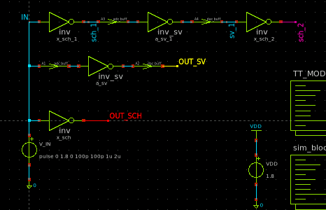
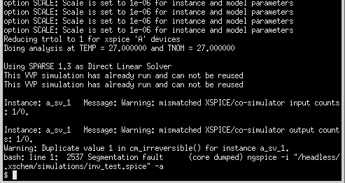

# **Inverter mixed-signal simulation**

## **Example - S.Schippers SAR ADC simulation**

If you want to get familiar with how to create mixed signal simulations in Xschem I strongly advise to check out Stephan Schippers SAR ADC example:  
[youtube link to his video](https://youtu.be/PPd7jkcHOgA)  
[Important github discussion that mentions multi-module simulations](https://github.com/StefanSchippers/xschem/discussions/417)  

Folder tree looks like this:  
``` bash
inv_mixed/
├── klayout
├── results
├── verilog
└── xschem
```
Whats inside the folders is straightforward - xschem has all schematics and symbols, verilog has all SystemVerilog ans Verilog files together with files created by Icarus Verilog or Verilator, results has simulations' *.raw files and *.code files that have the code blocks for testbench simulation, klayout was not used so its empty.  

## **Using Icarus Verilog to cosim**

I found Icarus (iverlog) to be easier to comprehend and easier to complete the cosim - Verilator has been updated to newer versions and current versions use a bit different syntax than S. Schippers used so I focused on Icarus Verilog.  

Icarus Verilog parses your code and generates an executable file in .vvp format. When you run vvp - an event-driven engine manages: a queue of events, scheduling signal changes and timing delays (#5, @(posedge clk))  

I created inverter using *nfet* and *pfet* from sky130A library for analog implementation called `inv.sch`. I created symbol for it and created a copy named `inv_sv.sym` which is a symbol used for SystemVerilog defined version of inverter.  
``` SystemVerilog
`timescale 1ps/1ps

module inv_sv (
    input  logic in,
    output logic out
);

assign out = ~in;

endmodule
```

The symbol has to have specific parameters in order to connect the vvp file to the simulation, it should look something like this:  
```
type=primitive
*format's pin names should match the symbol's pin names (case sensitive)
format="@name [ @@in ] [ @@out ] @symname"
template="name=a1 model=inv_sv device_model=\".model inv_sv d_cosim simulation=\"ivlng\" sim_args=[\"inv_sv.vvp\"] delay=1p\""
tclcommand="edit_file [abs_sym_path ../verilog/inv_sv.sv]"
```

Next step was creation of testbench for parallel inverters, since that's what I wanted to test first - and it was a good choice since thanks to that first thing I noticed after simulations succeded was the **1ns delay** - that's how I found out about the *d_cosim* ngspice model internal delay which is by default **1ns** and minimal value of this delay is **1ps**.  

On the testbech the **inv_sv** symbol should have the parameters set as following:  
```
name=a_sv 
model=inv_sv 
***Icarus_verilog***
device_model=".model inv_sv d_cosim simulation=\"ivlng\" sim_args=[\"inv_sv.vvp\"] delay=1p"
tclcommand="edit_file [abs_sym_path ../verilog/inv_sv.sv]"
```

Thanks to following S. Schippers video I realized:  
* how to use built-in graphs correctly  
* how to load data to graphs using `load waves` object  
* how to use tclcommand to your advantage via defining them for symbols and objects (similar to how `load waves` works - press Ctrl + LeftClick on the object)

Similarly to his design - I created tcl commands for objects and used them to build the *.vvp* file and load data to plots. The tcl command for Icarus Verilog file extraction looks like this:  
```
tclcommand="execute 1 sh -c \"iverilog -g2012 -o [abs_sym_path ../verilog/inv_sv.vvp] [abs_sym_path ../verilog/inv_sv.sv] && cp -f [abs_sym_path ../verilog/inv_sv.vvp] $netlist_dir/ \""
```

This command launches Icarus Verilog with 2 flags: **-g2012** is flag that calls Icarus with SystemVerilog up to 2012 support (iverlog has compatibility with more IEEE standards, more [Here](https://steveicarus.github.io/iverilog/usage/command_line_flags.html)), **-o** is output file. The last part is a sv top module file, if the simulation consisted of more modules you would have to expand this part. This command executes in the working directory and since we are inside `inv_mixed/xschem/` we need to back out to find the verilog files (thats what square brackets with abs_sym_path are for). Since the ngspice simulations are launched from `/headless/.xschem/simulations/` directory and that's exacly where ngspice is looking for .vvp file - we also want to copy the resulting iverilog output file into that directory - it can be replaced by `$netlist_dir` since its defined path for iic-osic-tools docker and ngspice recognizes it.  

When I finally had gotten satisfying results I tried to do the simulations of 3 inverters in series in one schematic, toghether with two of other in parallel (just as in the schematic below) - however the I didn't yet know about the ngspice restriction described in [This](https://github.com/StefanSchippers/xschem/discussions/417#discussioncomment-14468540) discussion:  
<figure style="margin: 12px 0;">
  <table style="width: 100%; border-collapse: collapse;">
    <tr>
      <td style="width: 50%; text-align: center; vertical-align: bottom; padding: 0 5px;">
        
        <div>a)</div>
      </td>
      <td style="width: 50%; text-align: center; vertical-align: bottom; padding: 0 5px;">
        
        <div>b)</div>
      </td>
    </tr>
  </table>
  <figcaption style="text-align: center;">Two instances of sv-simulated inverters: a) on schematic, b) simulation output - failed.</figcaption>
</figure>  

So when I figured out why I couldn't launch simulation as it was, I chose to separate the testbench into two different tesbench files: `inv_test_parallel.sch` and `inv_test_series.sch`, rather than creating one *top* module for only two inverters.  

After running simulation, results can be viewed on graphs that are on the schematic (Ctrl + LeftClick on *Load Waves* green arrow to launch tclcommand). When data from .raw files is loaded you can inspect the waves on schematic or open **gaw** viewer (Waves -> External viewer)

## **Using Verilator to cosim**

Verilator acts more like a compiler than an interpreter. It takes synthesizable Verilog/SystemVerilog code and translates ("verilates") it into highly optimized C++ or SystemC class models. You then compile this C++ code using gcc or clang alongside a C++ main file (testbench).  

For this you follow similar steps where parameter *device_model* of inverter will be different and you have to build the *.so* file using `verilator` command.

**TBD**