# **PPAU VLSI - Labolatorium 2**

Podczas tych zajęć poddane będą analizie rozrzuty technologiczne, jakie występują w zintegrowanych układach elektronicznych. W pierwszych krokach będą analizowane rozrzuty prądu klasycznego źródła prądowego i parametry od jakich one zależą, a następnie zbudowany będzie 5-cio bitowy przetwornik cyfrowo-analogowy DAC z ważonymi prądami.  
Wykorzystywane środowisko to IIC-OSIC-TOOLS ([github](https://github.com/iic-jku/iic-osic-tools)), a używany PDK to sky130A od SkyWater Foundries ([pdk-documentation](https://skywater-pdk.readthedocs.io/en/main/index.html)). Sama biblioteka sky130 ma wiele przykładowych komórek bazowych jak i testów dla różnych układów. Dostęp do wszystkich można znaleźć w różnych folderach tej biblioteki, gdzie przykładowo `sky130_tests/` zawiera wiele przykładowych bloków symulacji dla różnych układów, w tym wykorzystywane na tym labolatorium analizy parametryczne jak Monte Carlo. Ponieważ symulacje nie są kontrolowane za pomocą interfejsu graficznego, należy zapoznać się ze składnią poleceń ngspice (do sprawdzania składni i przykładów - [manual](https://ngspice.sourceforge.io/docs/ngspice-manual.pdf))  
Drzewo folderów, w których będzie wykonywana instrukcja wygląda następująco:  
``` bash
└── lab2
    ├── klayout
    ├── results
    └── xschem
```
Oczywiście można przyjąć inną koncepcję grupowania plików, mogą nawet być wszystkie w jednym folderze - należy tylko dostosować niektóre komendy w trakcie wykonywania instrukcji (przykładowo - w podpunktcie 3.1. przy kopiowaniu netlisty z folderu `simulations/` ).  


## **1. Rozrzuty w zintegrowanych układach logicznych**
---

1.1. Przygotuj schemat układu źródła prądowego z Rys. 1.1. i nazwij schemat *CURRENT_SOURCE*. Jako tranzystorów użyj **pfet_01v8** z biblioteki **sky130_fd_pr** (fd - The SkyWater Foundry, pr - Primitive Cells; więcej o nazewnictwie w sky130 PDK można znaleźć [tutaj](https://skywater-pdk.readthedocs.io/en/main/contents/libraries.html#library-naming) oraz [tutaj](https://vlsida.github.io/chip-tutorials/sky130.html#naming-convention)), a dla całego schematu użyj parametrów:  
   * szerokość i długość kanału mosfetów -> odpowiednio **W_DAC** i **L_DAC**  
   * Źródłu prądowemu -> parametr **I_DAC**  
   * Źródłu napięcia -> parametr **VDD_val**  

Aby w realizowanych analizach wyeliminować błąd systematyczny związany z różnymi napięciami Vds tranzystorów, użyj źródła napięciowego sterowanego napięciem - **vcvs** - z domyślnej biblioteki **devices** z ustawionym wzmocnieniem 1. Elementy widoczne na schemacie takie jak źródła prądowe, napięciowe, symbole zasilania, uziemienia czy bloki kodu także można znaleźć w tej bibliotece. Napięcie zasilania VDD powinno być równe 1.8V.  
Wykorzystany blok kodu o nazwie **TT_MODELS** to gotowy blok, który jest łatwo i szybko dostępny wybierając na pasku menu `SKY130 -> Add model symbol` (Rys 1.2.) i dla parametrów typowych nie musi być edytowany.

<figure style="text-align: center; page-break-inside: avoid; break-inside: avoid;">
  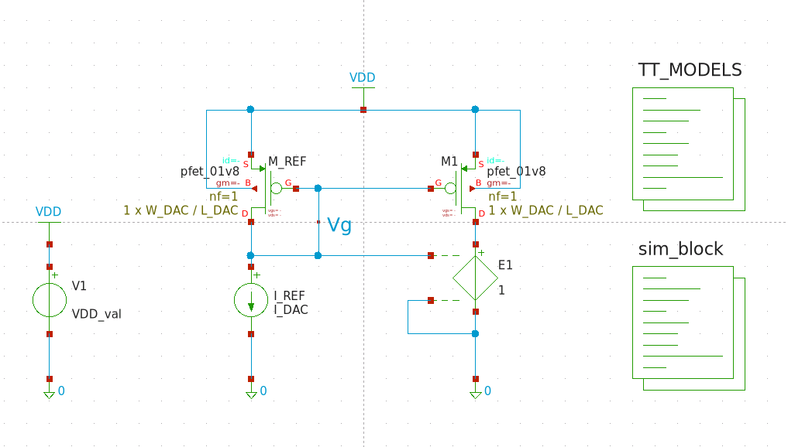
  <figcaption>Rys 1.1. Schemat źródła prądowego.</figcaption>
</figure>

<figure style="text-align: center; page-break-inside: avoid; break-inside: avoid;">
  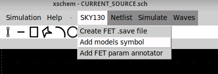
  <figcaption>Rys 1.2. Dodanie bloku kodu zawierającego bibliotekę.</figcaption>
</figure>

1.2. Następnie sprawdzimy punkt pracy tranzystorów PMOS.
> Dla trzech różnych wymiarów tranzystorów W / L odpowiednio:  
> * 0.42 / 0.15 [μm/μm]  
> * 5 / 3.5 [μm/μm]  
> * 3.5 / 5 [μm/μm]  
> oraz dwóch różnych prądów I_DAC:
> * 100 [nA]  
> * 10 [μA]  
> 
> Wyznacz napięcia **Vgs** i **Vth** tranzystora M1. Uzyskane wyniki zanotuj w sprawozdaniu.

1.3. Aby przeprowadzić analizy Monte Carlo musisz wskazać środowisku symulacyjnemu modele elementów technologicznych, w których będą występowały parametry związane z rozrzutami technologicznymi. Modele te są identyczne jak te stosowane do tej pory, a różnią się jedynie dodatkowymi zmiennymi odpowiedzialnymi za rozrzuty.  
W tym celu wystarczy zmienić parametr, z którym wywoływana jest biblioteka w bloku TT_MODELS. W lini, w której załączana jest biblioteka (.lib $::SKYWATER_MODELS/sky130.lib.spice tt) zamień `tt` na wybrany corner. Na razie zastąp to przez `tt_mm`. Warto też zobaczyć co dokładnie znajduje się w załączanym pliku. 
``` bash 
cd /foss/pdks/sky130A/libs.tech/combined
view sky130.lib.spice
```
 
1.4. W środku pliku `sky130.lib.spice` można zauważyć dużo zdefiniowanych cornerów wraz z informacją, które biblioteki z tego folderu są dołączane. Dla każdego corneru ustawiane są dwa parametry - przejrzyj te cornery, szczególnie **tt**, **tt_mm**, **mc**, i zastanów się do czego są te parametry i co oznaczają.  

1.5. W kolejnym kroku skonfiguruj symulację Monte Carlo. W Xschem jest to realizowane przez załączanie odpowiednich plików bibliotecznych (blok TT_MODELS) oraz pętli kodu ngspice. Przykład takiej pętli jest dostępny na schemacie `sky130_tests/montecarlo_mismatch_sim.sch` w bloku kodu "NGSPICE". Alternatywą dla bloku TT_MODELS jest dostępny symbol `sky130_fd_pr/corner.sym`, w którym zmieniając wyłącznie parametr *corner* można dołączyć odpowiednie pliki. Blok TT_MODELS ze względu na to że zawiera pole kodu zamiast pojedynczego parametru, przez co możemy je wykorzystać do definicji idealnej instancji - który nie będzie podlegał rozrzutom.  

Dane można zbierać do plików za pomocą `echo [text and vectors] >> [file_path/filename]` lub przykładowo: polecenia `wrdata` , `write` (więcej informacji o formacie zapisu oraz o sposobach zapisu danych do pliku można znaleźć w [ngspice manual](https://ngspice.sourceforge.io/docs/ngspice-manual.pdf)). **TU MOŻE COŚ ZMIENIĆ** Aby wyświetlić wyniki w formie graficznej zebrane dane w plikach można wyeksportować i wyplotować za pomocą wbudowanego `gnuplot` bezpośrednio z otwartej konsoli dockera lub ngspice'a. Dzięki dostępowi do konsoli dockera można pisać skrypty .sh, .tcl, które z zapisanych danych będą tworzyć wykresy i zapisywać je do plików graficznych.  

1.6. Rozrzuty w PDK Sky130 są sterowane globalnie poprzez parametry **mc_mm_switch** i **mc_pr_switch**. Jeśli chcesz, aby dany tranzystor (np. lustro referencyjne M_REF) nie podlegał zmianom związanym z mismatchem czy procesem należy stworzyć idealny model naszego elementu, który nie będzie brał pod uwagę globalnie zadefiniowanych rozrzutów. Sprowadzać się to będzie do stworzenia podobwodu, który będzie miał wyłączone parametry kontrolujące mismatch i process (wartości tych parametrów dla podobwodów są traktowane lokalnie, więc nie trzeba się martwić o nadpisywanie wcześniej dodanych parametrów). Nazwa modelu powinna dokładnie opisywać element i jego funkcję. Warto pamiętać przyjętej konwencji do nazywania elementów dla danej biblioteki - w naszym przypadku, dla przykładowo PMOS-a, wygląda to następująco: `sky130_fd_pr__` to fragment wskazujący na bibliotekę, a `pfet_01v8` to nazwa modelu. Można zweryfikować jak wyglądają definicje instancji sprawdzając netlistę (skrót klawiszowy *Shift + N* lub *N*, następnie `Simulation -> Edit Netlist`).  
Dzięki zachowaniu tej składni, po dodaniu fragmentu definiującego podschemat, wystarczy zamienić parametr *model* danego elementu (w naszym przypadku PMOS-a) bez tworzenia nowego symbolu dla tego modelu.  

1.7. W naszych następnych symulacjach chcemy analizować rozrzuty pochodzące jedynie od tranzystora M1. Ponieważ domyślnie włączenie `.param mc_mm_switch = 1` aktywuje losowanie parametrów dla wszystkich elementów na schemacie, aby zasymulować idealne źródło referencyjne M_REF (bez rozrzutów) stworzymy dla tego schematu wspomiany subcircuit - pamiętając o konwencji nazywania elementów w bibliotece.  

``` spice
* disable pfet_ideal from mismatch/process
.subckt sky130_fd_pr__pfet_ideal D G S B W=0.42 L=0.15
+ nf=1 ad='int((1 + 1)/2) * {W} / 1 * 0.29' as='int((1 + 2)/2) * {W} / 1 * 0.29'
+ pd='2*int((1 + 1)/2) * ({W} / 1 + 0.29)' ps='2*int((1 + 2)/2) * ({W} / 1 + 0.29)' 
+ nrd='0.29 / {W}' nrs='0.29 / {W}' sa=0 sb=0 sd=0 mult=1
  .param mc_mm_switch=0
  .param mc_pr_switch=0
  XIDEAL D G S B sky130_fd_pr__pfet_01v8 W={W} L={L}
  + nf={nf} ad={ad} as={as} pd={pd} ps={ps} 
  + nrd={nrd} nrs={nrs} sa={sa} sb={sb} sd={sd} mult={mult}
.ends
```
Ten fragment można dodać do któregokolwiek bloku kodu, ale zalecane jest dodanie go do bloku TT_MODELS gdzie oprócz dodawania plików cornerowych będziemy także uwzględniać efekty mismatchu i procesu.  
Zamień teraz model tranzystora M_REF z `pfet_01v8` na `pfet_ideal`. Jeżeli do tej pory wszystko poprawnie zostało zrobione - symulacja będzie uwzględniać rozrzuty wyłącznie pochodzące od tranzystora M1.  

1.8. Przeprowadź analizy Monte Carlo (100 prób dla każdego z przypadków) dla wariantów prądów oraz wymiarów tranzystorów M_REF i M1 podanych uprzednio (pamiętając o uwzględnieniu wyłącznie M1 w rozrzutach).  
> Uzyskane wyniki σ/AVG (sigma/wartość średnia) zanotuj w sprawozdaniu. Uzupełnij wszystkie brakujące pola w tabeli.  


1.9. Odpowiedz na poniższe pytania:  
> a) dlaczego dla tych samych wymiarów tranzystorów a różnych prądów znacząco różnią się wartości σ/AVG?  
> b) dlaczego dla tych samych zarówno powierzchni tranzystorów jak i ich prądów wartości σ/AVG różnią się pomiędzy sobą?  
> c) wskaż dwa z analizowanych przypadków, które dowodzą różnych kontrybutorów rozrzutów (kontrybucja od napięcia progowego, kontrybucja od współczynnika prądowego).  


1.10. Sprawdź stopień kontrybucji rozrzutów prądu wyjściowego (σ/AVG) dla trzech przypadków - rozważ tylko wymiary PMOS-a 3.5 μm / 5 μm oraz I_DAC = 10 μA oraz rozrzuty pochodzące tylko z mismatchu ( `.mc_mm_switch=1 .mc_pr_switch=0` ):  
> a) uwzględniamy tylko rozrzuty tranzystora M1 (*model* M_REF ustaw jako `pfet_ideal`),  
> b) uwzględniamy tylko rozrzuty tranzystora M_REF (*model* M1 ustaw jako `pfet_ideal`),  
> c) uwzględniamy rozrzuty obu tranzystorów (*model* obu tranzystorów to `pfet_01v8`).  

Wyniki zapisz w sprawozdaniu. Czy są one zgodne z Twoimi przypuszczeniami? Dlaczego?  

1.11. Powtórz symulacje z poprzedniego punktu uwzględniając proces. 
> Uwzględnij rozrzuty Process i Mismatch (`.mc_mm_switch=1 .mc_pr_switch=1`). Wyjaśnij występujące różnice.  


## **2. Schemat 5-bitowego DAC-a**
---

2.1. W dalszej części ćwiczenia będziesz budować 5-bitowy przetwornik DAC. Dlatego utwórz schemat i jego symbol zgodnie z Rys. 2.1. Nazwij go *DAC_CORE_5bit*. Źródła prądowe M0 - M4 mają wymiary W/L = 3.5 μm / 5 μm, zaś wymiar kluczy MK0 - MK4 to W/L = 0.42 μm / 0.15 μm.  

<figure style="text-align: center; page-break-inside: avoid; break-inside: avoid;">
  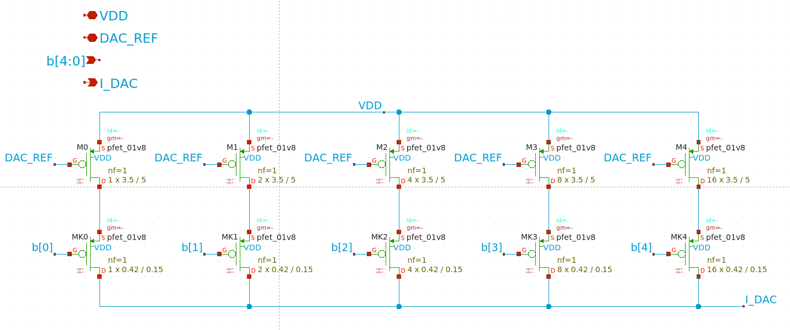
  <figcaption>Rys 2.1. Schemat 5-bitowego DAC-a.</figcaption>
</figure>

2.2. Odpowiedz na pytanie w sprawozdaniu:  
> Czy istotnym jest by liczba tranzystorów pracujących jako klucze odpowiadała liczbie tranzystorów pracujących jako źródła prądowe? Uzasadnij dlaczego.  

2.3. Zbuduj schemat na potrzeby symulacji tak jak na Rys. 2.2. Ustaw następujące parametry:  
* prąd źródła prądowego ustaw za pomocą rezystora RES_DAC - tak, aby wynosił on 10 μA,  
* rezystancję R_OUT na wartość 100 ,  
* wymiary tranzystora M_REF, W/L = 3.5 μm /5 μm.  

Rezystory oraz źródła napięciowe widoczne na schemacie pochodzą z biblioteki biblioteki **devices**. Zwróć uwagę na podłączenie źródeł napięcia stałego V0 - V4. Są one podpięte między wejścia b[4:0] a szynę napięcia zasilającego VDD. Wynika to z faktu, że wyjściowe napięcia tych źródeł przyjmują wartości 0V bądź VDD, a tranzystory DAC-a to tranzystory typu PMOS (active low). W kolejnym kroku należy w odpowiedni sposób zdefiniować wartości napięć stałych tak, by móc przeprowadzić symulację charakterystyki prądu wyjściowego DAC-a w funkcji jego wejść b[4:0]. W tym celu można skorzystać ze źródła napięcia stałego `vsource`, w którym w pozycji *value* należy wpisać:  

* dla V0: `{ VDD * ((dac_bit - 2*int(dac_bit/2))) }`  
* dla V1: `{ VDD * ((dac_bit - 4*int(dac_bit/4)>1)) }`  
* dla V2: `{ VDD * ((dac_bit - 8*int(dac_bit/8)>3)) }`  
* dla V3: `{ VDD * ((dac_bit - 16*int(dac_bit/16)>7)) }`  
* dla V4: `{ VDD * ((dac_bit - 32*int(dac_bit/32)>15)) }`  

<figure style="text-align: center; page-break-inside: avoid; break-inside: avoid;">
  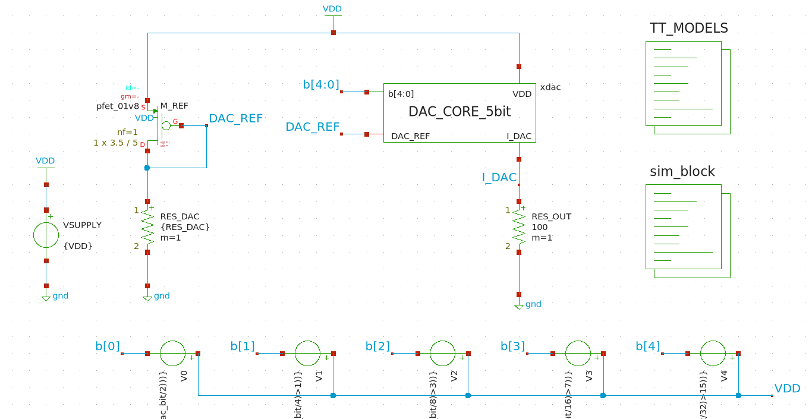
  <figcaption>Rys 2.2. Schemat układu do symulacji.</figcaption>
</figure>

W powyższym zapisie VDD i dac_bit oznaczają parametry (zmienne projektowe) odpowiednio napięcia zasilania 1.8 V i cyfrowego słowa na wejściach b[4:0], które zmienia się w zakresie 0-31.
Powyższą składnia ma za zadanie generować napięcia na wyjściach źródeł V0 - V4 tak by dla zmian dac_bit w zakresie 0-31 we właściwy sposób ustawić wejścia b[4:0] (od stanu 00000 do stanu 11111 włącznie).  
> Przetestuj działanie źródła V0 dla wartości parametru dac_bit z zakresu 0-5 i zanotuj napięcie tego źródła dla tego zakresu. Możesz zasymulować działanie układu poprzez wektory ngspice lub wykorzystać stworzony układ (podpowiedź: wykorzystaj odwołanie do wartości elementu `@v0[dc]`) Możesz wykorzystać Uzyskane wyniki zapisz w sprawozdaniu.  

2.4. Po wykonaniu poprzedniego punktu przeprowadź analizę *OP* dla wartości słowa wejściowego 0 - 31.  
> Wyznacz charakterystykę przejściową DAC-a dla zmian dac_bit 0 - 31 z krokiem 1. Umieść ją w sprawozdaniu. Aby zweryfikować poprawność swojej odpowiedzi na pytanie z podpunktu 2.2. - wyznacz również charakterystykę przejściową zmodyfikowanego DAC-a, w którym każdy z kluczy MK0 - MK4 zastąpisz pojedynczym tranzystorem (co sprowadza się do zmiany wartości parametru mult na 1 dla każdej gałęzi). Umieść obie charakterystyki w sprawozdaniu. Czy Twoje przypuszczenia były poprawne?  
> Zapisz również w sprawozdaniu:  
> * Rezystancję RES_DAC, dla której źródło prądowe generuje 10 μA  
> * największy generowany przez przetwornik prąd I<sub>DAC_MAX</sub>.  

**UWAGA:** „napraw" schemat przetwornika przed przejściem do kolejnych kroków - liczba kluczy powinna się zgadzać z liczbą źródeł prądowych w danej gałęzi.  

2.5. Wyznacz, ile wynoszą rozrzuty prądów generowanych przez DAC-a (σ) oraz ile wynosi wartość σ/AVG. Pod uwagę weź jedynie Mismatch oraz rozrzuty samego bloku *DAC_CORE_5bit*. Rozpatrz wartości zmiennej dac_bit: 1, 2, 4, 8, 16, 31.  
> Wyniki z tego podpunktu zapisz w sprawozdaniu. Czy dostrzegasz jakieś związki pomiędzy poszczególnymi wynikami a liczbą załączonych tranzystorów? Jakie są to relacje?  

2.6. Przeprowadź analizę MC (tylko bloku DAC i jedynie z opcją Mismatch) charakterystyk wyjściowych DAC-a.  
> Ile wynosi wartość średnia, maksymalna i minimalna generowanego prądu dla dac_bit = 31?  

2.7. Teraz skonfigurujesz środowisko by móc przeprowadzić analizy brzegowe. Jak już pewnie zauważyłeś - blok TT_MODELS od razu przypisuje profil nominalny dla naszych symulacji. Jeżeli przeglądałeś plik `sky130.lib.spice` na pewno zauważyłeś dużą ilość i różnorodność analiz brzegowych.  

2.8. Twoim zadaniem będzie zdefiniowanie analiz brzegowych. Standardowo realizuje się to w oparciu o dokumentację dostawcy technologii (na zajęciach przeprowadzisz kilka z tych analiz). W tym celu zmodyfikuj odpowiednio blok kodu, w którym definiowałeś symulacje - będziesz wykonywał pojedyńczą symulację *OP* i zapisywał prąd wyjściowy DAC-a. Parametry powinny być takie same jak w poprzednich krokach instrukcji.  

2.9. Nazwy cornerów, które wpisujesz, odnoszą się do warunków brzegowych procesu, takich jak najmniejsza/największa ruchliwość nośników, najmniejsze/największe napięcie progowe. Po zdefiniowaniu analizy brzegowej stwórz netlistę i włącz symulację cornerową - prąd dla corneru tt powinien pokrywać się z maksymalnym prądem otrzymanym w podpunkcie 2.4. 

2.10. Powtórz proces symulacji obwodu dla cornerów: tt, ss, ff, sf, fs.  
> Zanotuj typowy, maksymalny i minimalny prąd jaki generuje DAC dla dac_bit = 31. Porównaj go z przeprowadzonymi wcześniej analizami MC. Które wyniki są mniej korzystne i dlaczego?  

## **3. Layout 5-bitowego DAC-a**
---

3.1. W kolejnej części zajęć będziesz tworzyć projekt masek testowanego uprzednio przetwornika cyfrowo-analogowego. W tym celu otwórz program Klayout w trybie edycji: `klayout -e`. Utwórz nowy layout wybierając na pasku menu `File -> New Layout`. Powinieneś zobaczyć okno jak na Rys 3.1., na razie nic nie zmieniaj i kliknij *OK*.  
Pomimo tego, że Klayout automatycznie jest włączany z sky130A PDK, to w samym programie i tak trzeba wybrać wykorzystywaną technologię - może być to zrobione w każdym momencie wykonywania layoutu, ale najlepiej od tego zacząć przed pracą. Na pasku narzędzi widoczna jest ikona zębatki z literą 'T' - rozwiń to narzędzie, wybierz technologię sky130A i kliknij na ikonę. Po prawej stronie powinieneś zobaczyć warstwy zdefiniowane w tej technologii. Jeżeli nadal ich nie widzisz to dlatego, że są nie używane i domyślnie są ukryte - kliknij prawym przyciskiem myszy w oknie *Layers* i odznacz *Hide Empty Layers*.  

<figure style="text-align: center; page-break-inside: avoid; break-inside: avoid;">
  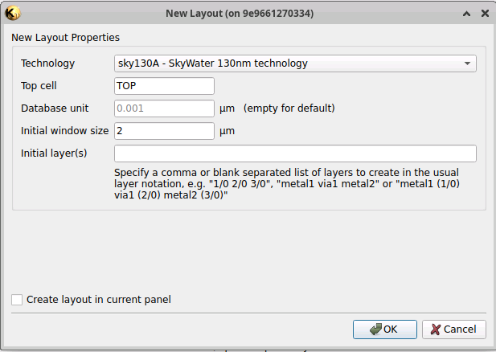
  <figcaption>Rys. 3.1. Okno tworzenia nowego layoutu.</figcaption>
</figure>

**UWAGA:** Aby ten fragment instrukcji przebiegł pomyślnie, należy zaktualizować "NetlistImportPlugin" ( `Tools -> Manage Packages` ); w przeciwnym wypadku wersja 0.6XXX będzie zwracać błędy makr przy importowaniu elementów dla zmodyfikowanych parametrów.  

Jeżeli przed tym punktem wyłączałeś sesję dockera i nie zrobiłeś kopii netlisty schematu *DAC_CORE_5bit* do folderu wspołdzielonego ( `/foss/designs/...` - podfoldery i pliki tego folderu są współdzielone między twoim użytkownikiem i sesjami dockera) to musisz stworzyć netlistę tego schematu jeszcze raz w programie Xschem. Gdy uruchomisz schemat wybierz `Simulation -> LVS -> LVS netlist + Top level is a .subckt`. Utworzone przez Xschem netlisty domyślnie znajdują się w folderze `/headless/.xschem/simulations` - dlatego skopiuj ją do swoich plików. Netlista nazywa się identycznie jak schematic, różni się tylko rozszerzeniem - *.spice*. Poniższe polecenie skopiuje tą netlistę - zakładając, że pracujesz w folderze lab2, jeżeli korzystasz z innego drzewa plików, zamień fragment `/foss/designs/lab2/xschem/` konsekwentnie.  
``` bash
cp /headless/.xschem/simulations/DAC_CORE_5bit.spice /foss/designs/lab2/xschem/
```
Teraz zaimportujesz do utworzonego okna Layoutu elementy uprzednio stworzonego schematu *DAC_CORE_5bit*. Z paska menu wybierz `File -> Import -> Netlist`. Jeżeli zaktualizowałeś Plugin w obecnej sesji to Klayout wyświetli powiadomienie o zmianie Cell Mapping - kliknij *Yes* i kontynuuj importowanie. Powinieneś zobaczyć okno do importowania - w polu *Source File* wybierz plik z netlistą klikając *...* po prawej stronie pola lub bezpośrednio wpisz ścieżkę do pliku (można też samą nazwę pliku - domyślnie wyszukuje w folderze, z którego został włączony klayout). Kliknij **Reload Net** w prawym dolnym rogu. Po rozwinięciu `Reference - TOP` powinieneś zobaczyć wszystkie elementy, które poprzenio naniosłeś na schemat. Powinieneś zobaczyć okno jak na Rys 3.2.  

<figure style="text-align: center; page-break-inside: avoid; break-inside: avoid;">
  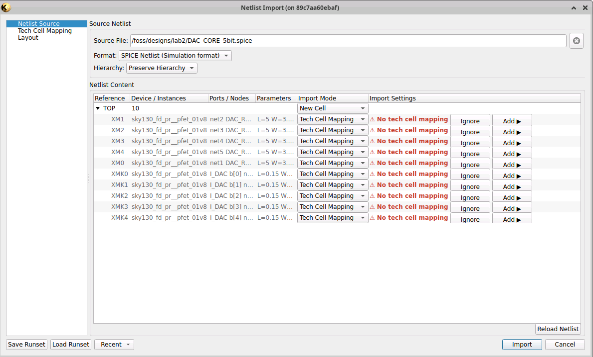
  <figcaption>Rys. 3.2. Okno importowania elementów z netlisty.</figcaption>
</figure>

Tech Cell Mapping to etap translacji, w którym KLayout łączy tekstowe nazwy elementów z Twojej netlisty z ich rzeczywistymi, fizycznymi parametryzowanymi komórkami (PCells) z biblioteki sky130A. Ostrzeżenie **No tech cell mapping** oznacza, że KLayout widzi w netliście element sky130_fd_pr__pfet_01v8, ale nie wie jeszcze, którą komórkę z biblioteki PDK wygenerować ani jak odwzorować ich parametry na wymiary fizyczne w layoucie. Aby rozwiązać ten problem i skonfigurować mapowanie elementów:
1. Kliknij **Add >**, zostaniesz przeniesiony do zakładki *Tech Cell Mapping* z paska bocznego.  
2. Uzupełnij teraz Cell Mapping dla naszego PMOS-a:
   * W polu **Netlist Device** wpisz model naszego PMOS-a: `sky130_fd_pr__pfet_01v8`  
   * W polu **Target Library** wybierz: `skywater130`  
   * W polu **Target Cell** wybierz : `pfet`  
   * Pole **Parameters** zmodyfikuj na: `w=@W l=@L ng=@nf`  
3. Opcjonalnie: można zapisać konfigurację dla PMOS-ów i w przyszłości przy używaniu większej różnorodności elementów z biblioteki można dopisywać tylko pozycje do konfiguracji - Kliknij *Save As...* i wybierz ścieżkę gdzie zapisać plik.

W zakładce *Layout* ustaw **Pitch** na 6.5 μm Okno importowania powinno wyglądać tak jak na Rys. 3.3.a) na zakładce X, a na zakładce Y - zgodnie z Rys. 3.3.b) .  

<figure style="margin: 12px 0;">
  <table style="width: 100%; border-collapse: collapse;">
    <tr>
      <td style="width: 50%; text-align: center; vertical-align: bottom; padding: 0 5px;">
        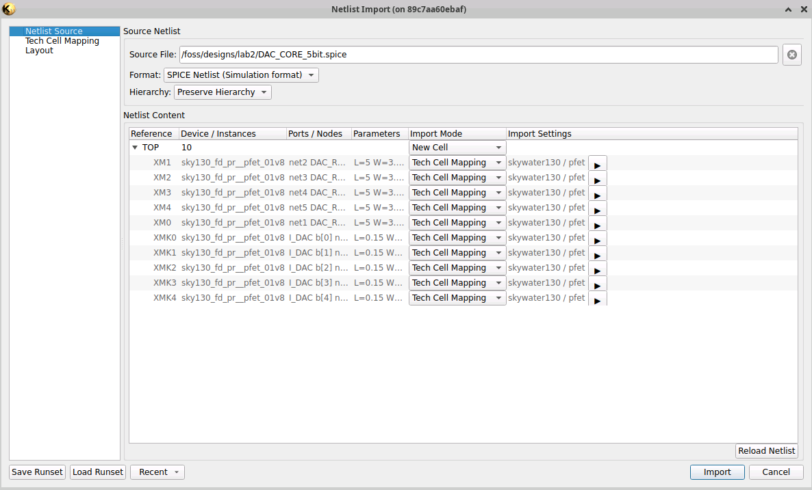
        <div>a)</div>
      </td>
      <td style="width: 50%; text-align: center; vertical-align: bottom; padding: 0 5px;">
        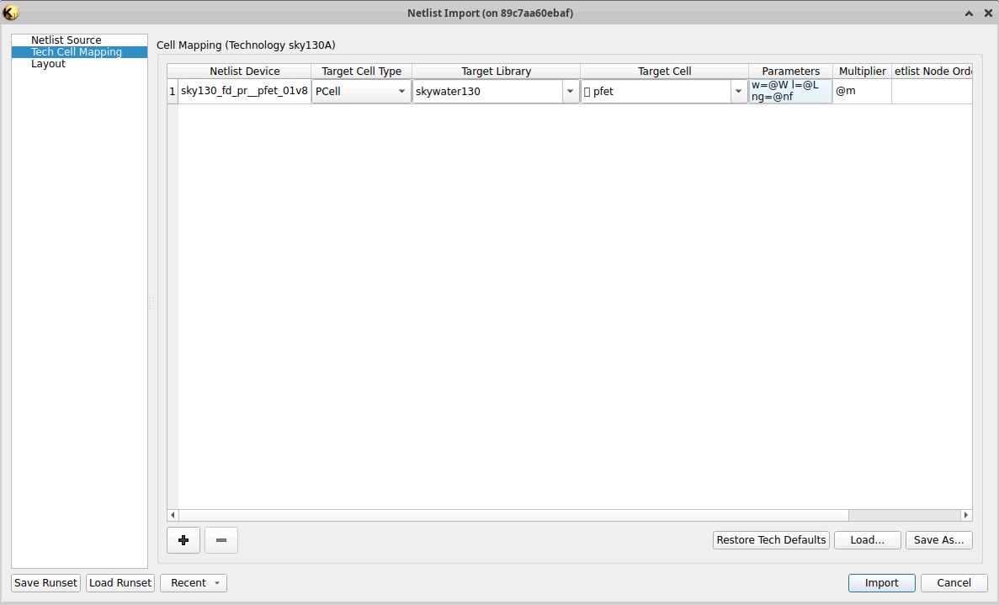
        <div>b)</div>
      </td>
    </tr>
  </table>
  <figcaption style="text-align: center;">Rys. 3.3. Okno importowania elementów z netlisty: a) zakładka Netlist Source, b) zakładka Tech Cell Mapping.</figcaption>
</figure>

Jeżeli wszystko wygląda tak samo - kliknij **Import**. Powinien wyświetlić się raport z importowania - jeżeli wszystko przebiegło pomyślnie, zobaczysz w raporcie "Cells succeeded: 1 ... Instances succeeded: 62" Okno twojego projektu powinno wyglądać jak na Rys. 3.4. - utworzony przez Ciebie widok zawiera po 31 tranzystorów pełniących funkcję źródeł prądowych oraz kluczy elektronicznych.  

<figure style="text-align: center; page-break-inside: avoid; break-inside: avoid;">
  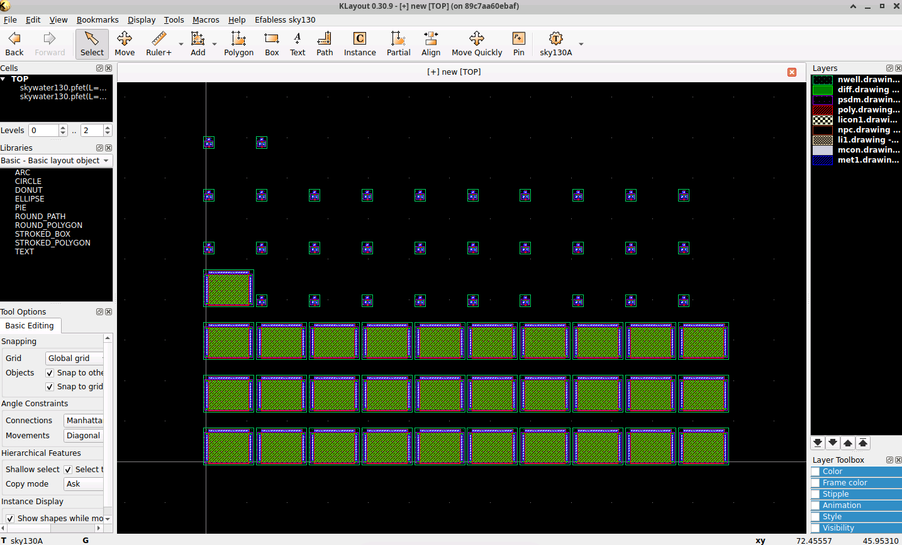
  <figcaption>Rys. 3.4. Widok layoutu komórki DAC_CORE_5bit po zaimportowaniu elementów z netlisty.</figcaption>
</figure>

3.2. Zauważ, że masz do czynienia z dwiema grupami tranzystorów: są to źródła prądowe oraz klucze elektroniczne, przy czym każda z tych grup ma te same wymiary kanałów. Wiemy również, że jedną z metod, która pozwala ograniczyć rozrzuty technologiczne jest grupowanie elementów o takich samych wymiarach blisko siebie oraz wykorzystanie metody minimalizacji gradientu domieszek czy temperatury na powierzchni układu scalonego (metoda common centroid). Dlatego warto przy projekcie masek przetwornika, ułożyć tranzystory w postaci matrycy.  
Usuń zaimportowane instancje tranzystorów z poprzedniego kroku, tak aby pozostało ci puste okno layoutu. Dodaj ręcznie tranzystor PMOS:
* wykorzystując *Create a cell Instance* z paska narzędzi (bądź skrót klawiszowy ***I***) i w lewym dolnym rogu wybierz instancję `pfet` z biblioteki **skywater130 - sky130 Pcells**.  
* wybierając bibliotekę **skywater130 - sky130 Pcells** w narzędziu *Libraries* (lewe okno narzędzi) przeciągając instancję `pfet`.  

Dostosuj wymiary tej komórki zgodnie ze źródłami prądowymi ze schematu - możesz to zrobić w trakcie umieszczania modelu wykorzystując jedną z zakładek narzędzia *Tool Options -> Pcell* lub edytować położoną instancję w oknie ***Instance Properties*** dostępnego po kliknięciu na PMOS-a lewym przyciskiem myszy i następnie kliknięciu skrótu klawiszowego ***Q***. Rys 3.5.a) przedstawiono okno, które powinieneś zobaczyć.  
Następnie utwórz matrycę tranzystorów pracujących jako źródła prądowe poprzez wybranie w sekcji *Geometry* w oknie *Instance Properties* opcji **Array Instance**. Wypełnij okno jak na Rys. 3.5.b), Pola Column/Row vector (x,y) służą do definiowania odstępów pomiędzy elementami tworzącymi matrycę - jeżeli nie zostaną uzupełnione to wszystkie instancje będą w jednym miejcu co zaprzecza temu co chcemy otrzymać. Zwróć uwagę, że na tym etapie tworzysz matrycę 6 × 6 elementów - być może będziesz tę ilość później modyfikować. Po wypełnieniu sekcji *Geometry* naciśnij *OK*. Otrzymany widok powinien przypominać Rys. 3.6.  

<figure style="margin: 12px 0;">
  <table style="width: 100%; border-collapse: collapse;">
    <tr>
      <td style="width: 50%; text-align: center; vertical-align: bottom; padding: 0 5px;">
        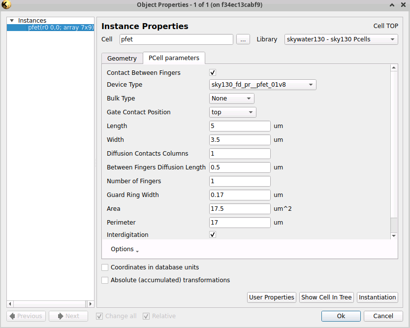
        <div>a)</div>
      </td>
      <td style="width: 50%; text-align: center; vertical-align: bottom; padding: 0 5px;">
        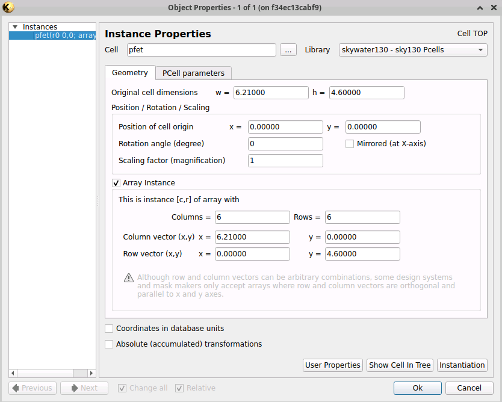
        <div>b)</div>
      </td>
    </tr>
  </table>
  <figcaption style="text-align: center;">Rys. 3.5. Okno edytowania własności instancji: a) zakładka PCell parameters, b) zakładka Geometry.</figcaption>
</figure> 

<figure style="text-align: center; page-break-inside: avoid; break-inside: avoid;">
  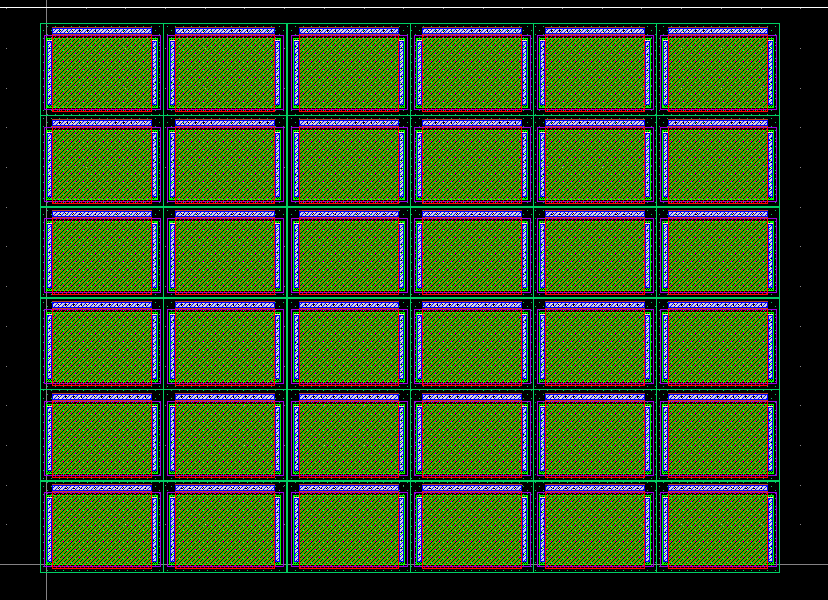
  <figcaption>Rys. 3.6. Wygenerowana matryca tranzystorów pracujących jako źródła prądowe.</figcaption>
</figure>

3.3. Zauważ, że wszystkie tranzystory pracujące jako źródła prądowe mają kilka wspólnych punktów (przypomnij sobie Rys. 2.1.). Są to: bramka (na potencjale DAC_REF) oraz podłoże i źródło (na potencjale górnej szyny zasilania VDD). Ponieważ bramka jest wykonana z przewodzącego prąd polikrzemu a w tym układzie nie będzie przez nią płynął prąd to każdą z bramek tranzystorów M0 - M4 można ze sobą połączyć polikrzemem. Każdy ze wspomnianych punktów wspólnych możesz połączyć ręcznie ale nie zaleca się takiego podejścia. Właściwym podejściem jest utworzenie swojej własnej komórki podstawowej, która po złożeniu w matrycę będzie łączyła ze sobą trzy wspólne punkty. Ważnym aspektem tego kroku jest również to, że biblioteka sky130A nie ma zdefiniowanej możliwości wyłączenia obecności kontaktu do bramki tranzystora - nie chcemy go mieć dla źródeł prądowych, gdyż będziemy podłączać każde źródło do DAC_REF jednym, wspólnym wyprowadzeniem na *met2*.  


3.4. W tym celu utwórz nową komórkę w oknie *Cells* (lewe okno narzędzi) i nazwij ją *DAC_BASE_MCS*. Powinieneś automatycznie pojawić się wewnątrz layoutu komórki - jeżeli tak się jednak nie stało to kliknij prawym przyciskiem myszy na komórkę *DAC_BASE_MCS* w oknie *Cells* i użyj `Show As New Top` .  
Po otworzeniu okna nowego layoutu umieść w nim jeden tranzystor PMOS o wymiarach kanału jak źródła prądowe M0 - M4. Następnie powinieneś spłaszczyć instancję PMOS-a aby mieć dostęp do modyfikacji jego warstw. Aby to zrobić kliknij raz na PMOS-a i z paska menu wybierz `Edit -> Selection -> Flatten Instances` i kliknij OK. Teraz możesz przejść do modyfikacji wyglądu maski - tak, aby po złożeniu go w matrycę, połączone były ze sobą bramka, źródło oraz podłoże. Użyj masek polikrzemu **poly** oraz pierwszej warstwy metalu **met1**, tak by Twoja komórka spełniała założony cel. Warto użyć narzędzia *Partial* z paska narzędzi do rozciągania elementów warstw (skrót klawiszowy *S*). Na Rys. 3.6., przy ustawieniach Column/Row vector (x,y) takich jak na Rys. 3.5.b) (Column(x)/Row(y) vector równe wymiarom komórki), podłoża będą ze sobą połączone, w związku z czym nie musisz dodawać nowych elementów warstwy podłoża tranzystora PMOS. Skróć jedynie warstwę **nwell**, aby była symetryczna względem dolnej części - pamiętaj, że będziesz musiał zmienić wartość Row(y) vector aby podłoża.**TUTAJ MOŻE ZMIENIĆ - ROZSZERZYĆ NWELL O 0.02um Z KAŻDEJ STRONY ŻEBY NIE NARUSZAĆ REGUŁY PSDM.1** Zapisz efekty swojej zmiany wybierając z paska menu `File -> Save As` . Przykład przed i po zmianach znajduje się na Rys. 3.7. 

<figure style="margin: 12px 0;">
  <table style="width: 100%; border-collapse: collapse;">
    <tr>
      <td style="width: 46.5%; text-align: center; vertical-align: bottom; padding: 0 5px;">
        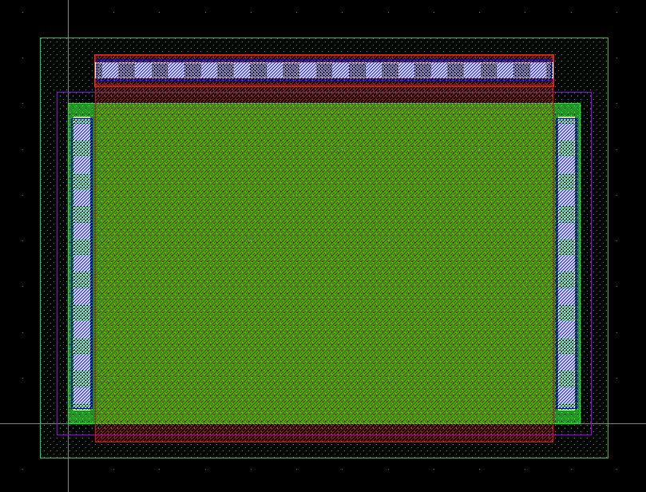
        <div>a)</div>
      </td>
      <td style="width: 50%; text-align: center; vertical-align: bottom; padding: 0 5px;">
        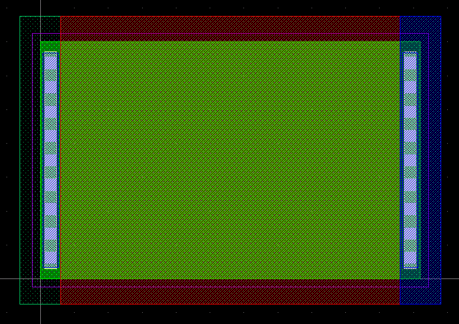
        <div>b)</div>
      </td>
    </tr>
  </table>
  <figcaption style="text-align: center;">Rys. 3.7. PMOS pracujący jako źródło prądowe: a) przed zmianami, b) po zmianach.</figcaption>
</figure> 

3.5. Następnie w komórce *DAC_CORE_5bit* (zmień na tą komórkę klikając prawym na nią w oknie *Cells* i wybierając `Show As New Top` ) umieść matrycę 6 × 6 elementów Twojej komórki podstawowej *DAC_BASE_MCS*. Rezultatem operacji powinien być widok jak na Rys. 3.8. Jeśli poprzednia matryca nie została przez Ciebie usunięta, wybierz jej właściwości (skrót klawiszowy *Q*) i zamień komórkę `pfet` na Twoją komórkę podstawową `DAC_BASE_MCS` - zamień Library na *Local (no library)* i wybierz swoją komórkę z listy.  

<figure style="text-align: center; page-break-inside: avoid; break-inside: avoid;">
  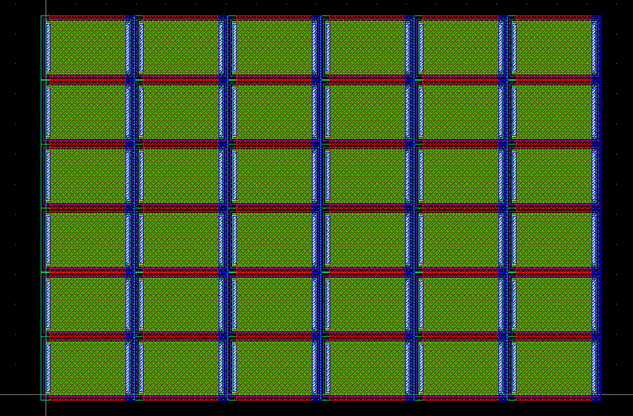
  <figcaption>Rys. 3.8. Matryca tranzystorów pracujących jako źródła prądowe złożona z komórek bazowych.</figcaption>
</figure>

3.6. Uruchom teraz analizę DRC (z paska menu `Efabless sky130 -> Run DRC (Full)` ), by sprawdzić, czy w projekcie nie ma złamanych reguł w projekcie masek. Powinien wielokrotnie pojawić się wyłącznie błąd **psdm.1**. Jest to błąd związany z zbyt małymi odległościami między obszarami domieszkowanymi. Na razie nie zajmuj się rozwiązaniem tego błędu. Jeśli występują u Ciebie inne, to je wyeliminuj tak by otrzymać wyłącznie ten błąd.  

3.7. Zastanów się i odpowiedz na ptanie:  
> Czy podobną metodą, opartą o komórkę podstawową, można zestawić matrycę kluczy elektronicznych? Jeśli tak to jakie połączenia będą tam wspólne?  

3.8. Przygotuj matryce źródeł prądowych oraz kluczy elektronicznych do prowadzenia połączeń. Miej na uwadze by zminimalizować błędy wprowadzane przez nieidentyczne otoczenie elementów układu. Jest to szczególnie istotne w odniesieniu do źródeł prądowych przetwornika DAC. Dlatego warto w projekcie masek źródeł prądowych umieścić dodatkowe (identyczne jeśli chodzi o wymiar kanału) tranzystory otaczające matrycę źródeł prądowych (nazwij je MD) - w tym projekcie proponuje się użyć matrycy 9 × 7 tranzystorów.  

3.9. Umieść matrycę 9 × 7 tranzystorów źródeł prądowych, a tranzystory zewnętrzne opisz etykietą "MD" wykorzystując obiekt `TEXT` z biblioteki **Basic** na warstwie *text.drawing - 83:44*. Zwróć uwagę, że wnętrze matrycy zawiera 35 tranzystorów, podczas gdy Ty potrzebujesz tylko 31 do realizacji źródeł prądowych. Tych 4 dodatkowych tranzystorów również użyjesz jako MD, ale nieco później. Matryca tranzystorów źródeł prądowych powinna wyglądać jak na Rys 3.9.  

<figure style="text-align: center; page-break-inside: avoid; break-inside: avoid;">
  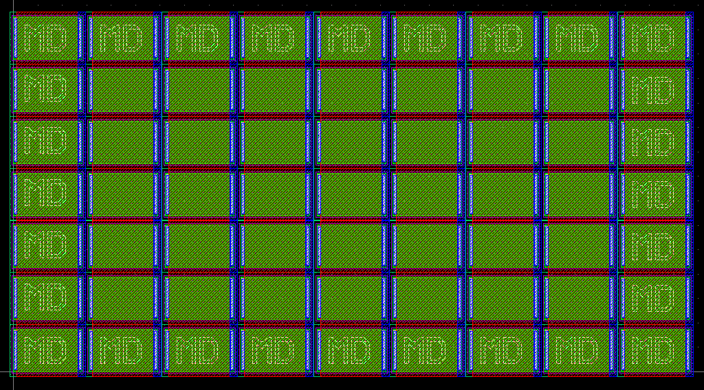
  <figcaption>Rys. 3.9. Matryca tranzystorów pracujących jako źródła prądowe wraz z tranzystorami dummy.</figcaption>
</figure>

3.10. Teraz umieść taką samą ilość tranzystorów dodatkowych MD na schemacie (będzie ich w sumie 33, jedno z nich będzie tranzystorem dummy dla kluczy). Częstą praktyką jest wykorzystanie tego typu dodatkowych elementów do innych zadań, np. do odprzęgania krytycznych linii. Dlatego wykorzystaj tranzystory MD jako kondensatory odprzęgające linię DAC_REF. Twój schemat po modyfikacjach powinien wyglądać jak na Rys. 3.10.  
UWAGA: zwróć uwagę na etykiety pomiędzy kluczami a źródłami prądowymi. Bez tych etykiet możesz mieć problem z analizą LVS. **CZY NA PEWNO???**    

<figure style="text-align: center; page-break-inside: avoid; break-inside: avoid;">
  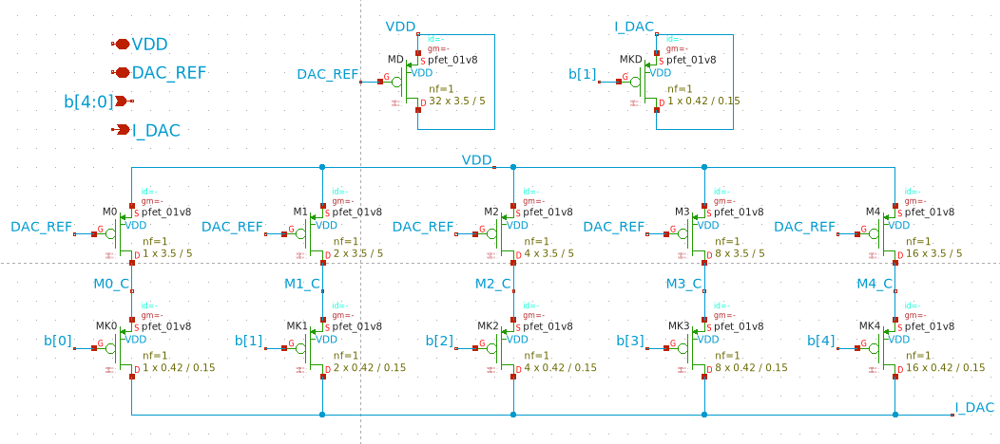
  <figcaption>Rys. 3.10. Schemat przetwornika cyfrowo-analogowego po umieszczeniu tranzystorów dodatkowych MD (dummy). UWAGA: zwróć uwagę na etykiety M*_C pomiędzy kluczami i źródłami prądowymi.</figcaption>
</figure>

**-- ZMODYFIKUJ PONIŻEJ DLA KLAYOUT --**  
3.11. Dodaj do tranzystorów pracujących jako źródła prądowe kontakty do ich bramek oraz pierścienie ochronne wokół dwóch grup tranzystorów: źródeł prądowych oraz kluczy elektronicznych. Weryfikuj swoje prace analizami DRC - teraz możesz rozwiązać wcześniejsze naruszenie reguł związanego z warstwą *psdm*. Są różne sposoby na rozwiązanie tego błędu - przykładowo można edytować *DAC_BASE_MCS* i rozszerzyć warstwę *nwell*, ale należy pamiętać że zmieni się wtedy wymiar komórki co ma wpływ na matrycę tranzystorów. Wstępny widok Twoich masek przetwornika DAC powinien przypominać ten na Rys. 3.11. 
**UWAGA**: Na Twoim planie masek matryca kluczy (po lewej) powinna składać się z 4 × 8 tranzystorów, a matryca źródeł prądowych (po prawej) powinna składać się z 9 × 7 tranzystorów.  
<!-- Na tym etapie powinny pozostać Ci tylko błędy dotyczące zbyt małych powierzchni metalu ME1 na bramkach kluczy elektronicznych (Rys. 3.9). Na tym etapie zaakceptuj ten błąd, bo w miarę jak będziesz realizować połączenia między elementami, zostaną one wyeliminowane.   -->

<figure style="text-align: center; page-break-inside: avoid; break-inside: avoid;">
  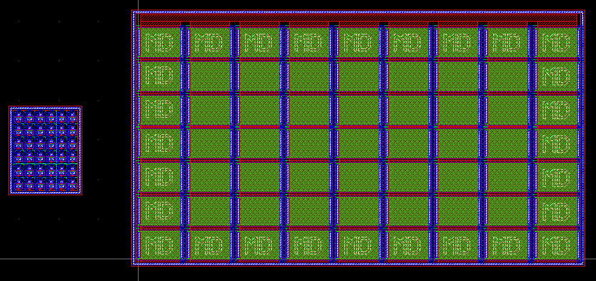
  <figcaption>Rys. 3.11. Rysunek poglądowy - matryca kluczy i matryca źródeł prądowych po dodaniu pierścieni ochronnych. UWAGA: Na Twoim planie masek matryca kluczy (po lewej) powinna składać się z 4 × 8 tranzystorów, a matryca źródeł prądowych (po prawej) powinna składać się z 9 × 7 tranzystorów.</figcaption>
</figure>

3.12. Teraz rozmieść źródła prądowe w matrycy wewnętrznej 7 × 5. W widoku masek używaj warstwy etykiet o nazwie *text.drawing*. 
> Ostateczne rozplanowanie tranzystorów umieść w tabelce ze sprawozdania.  

3.13. Przeprowadź połączenia wszystkich elementów przetwornika DAC tak by używać maksymalnie metalu na warstwie ME2. Poglądowy widok kompletnego projektu przedstawiony jest na Rys. 3.X. zaś na kolejnych rysunkach widoczne są poszczególne warstwy masek (Rys. 3.11 tylko ME1, Rys. 3.12 - tylko ME2).  

3.14. **TBD**  
> Po zakończeniu etapu tworzenia masek, braku błędów DRC i poprawnej weryfikacji LVS przeprowadź symulacje postekstrakcyjne przetwornika. Przy generacji widoku z elementami pasożytniczymi ustaw parametr Extraction Ref Node = VDD (zastanów się, dlaczego?). Sprawdź, czy występują różnice w analizie charakterystyki przejściowej przetwornika na poziomie schematu i postekstrakcji (odczytaj prądy przetwornika dla trzech różnych ustawień linii b<0:4> i zapisz je w sprawozdaniu).  
> Jeśli występują różnice, wyjaśnij ich źródło pochodzenia.  

3.15. Jeżeli zdecydowałeś się na dodatkowe kroki, które pomogły ci w tworzeniu schematu, symulacji, layoutu to:  
> Opisz te dodatkowe operacje jakie wykonałeś przy realizacji tego projektu (przykłady: dodatkowe struktury, sposób realizacji masek kluczy elektronicznych, etc.).  

## 4. Napotkane (niektóre/wybrane) problemy
* Przy włączaniu schematica *DAC_CORE_5bit_test.sch* schemat potrafi się zablokować i nie dać możliwości do edycji pliku. Dzieje się tak zazwyczaj gdy użytkownik chce edytować parametry i zamknie okno dialogowe edytowania parametrów.  
  Błąd w konsoli:  
  ```
  xschem [/foss/designs/lab2/xschem] tcleval(): evaluation of script: edit_prop {Input property:} failed
         : window ".dialog" was deleted before its visibility changed
  ```
  Rozwiązanie: Zauważyłem, że dzieje się tak gdy użytkownik przed edycją nie stworzy netlisty schematu przed edycją - czyli po włączeniu schematu należy zbudować netlistę. Nie znalazłem jeszcze konkretnego powodu dlaczego to ma wpływ, więc jest to chwilowe rozwiązanie.  
**TBD**

## TODO LIST
1. Znaleźć sposób na uwzględnienie rozrzutów tylko pojedynczego tranzystora i uzupełnić punkty 1.5 - 1.7 (znalazłem sposób - trzeba uzupełnić insturkcję) - zrobione (chyba dobrze)
   * *To co Defaultowo jest przez `SKY130->Add models symbol` może być zmienione poprzez modyfikację /foss/pdks/sky130A/libs.tech/xschem/xschemrc, ale to nie będzie pernamentna zmiana, a wyłącznie na obecną sesję dockera, do stałej zmiany można dodać plik /foss/designs/xschemrc **POD WARUNKIEM że będziemy startować każdy schematic z folderu /foss/designs co przy dużej ilości podfolderów i plików, czy kilkuosobowej pracy nad jednym projektem, może być niewygodne (trzeba być zapoznanym z drzewem folderów)***
   * *dla bardzo małych prądów, mogą powstawać niedokładności między dużą ilością powtórzeń. Czemu? Może to przez niedokładności w modelowaniu? to raczej nie jest problem tylko z .subckt - dla pfetów prosto z sky130 też tak to wygląda - sprawdzić jeszcze trzeba i sie zastanowić*
2. Przeprowadź analizę MC z punktu 1.8 i zapisz wyniki (kod do symulacji gotowy - ustawić M_REF jako mosfet idealny) - zrobione
3. Zaktualizuj polecenie 1.10 uwzględniając odpowiednie parametry i sposoby na rozrzucanie pojedynczego tranzystora - zrobione
4. Wykonaj symulacje zgodnie z punktem 1.11 - zrobione
5. **5BIT DAC SCHEMATIC** - zrobione
6. Stwórz symbol dla 5bit dac - zrobione
7. Stwórz schemat symulacyjny - zrobione
8. Przeprowadź symulacje działania układu - VTH jest na poziomie 1V dla W/L= 2/5 przez co nie jesteśmy w stanie uzyskać prądu bliskiego 10uA, nie bawić się w lvt-pfets, dla W/L= 2/5 vgs ~= 1.9V dla zasilania 1.8V X_X - modyfikacja W/L, obecnie 3.5/5, bez problemu można by było zostać przy W = 2 i zmniejszać L do momentu uzyskania odpowiedniego prądu
9.  Zastanów się jak zrobić symulacje cornerowe dla każdego przypadku (chodzi o każdy corner w jednej symulacji - czy jest to wogóle możliwe, jesli nie - po prostu zmieniaj corner co symulacje) - zostałem przy drugiej opcji, pierwsza do sprawdzenia
10. Layout DAC-a - TBD
11. Klayout jest dość intuicyjny, ale importowanie z netlisty wymaga aktualizacji "Packages", co trzeba robić za każdym odpaleniem dockera - nie znalazłem jeszcze jednoznacznego rozwiązania, dzięki któremu mógłbym mieć najnowsze makra dla każdej instancji dockera (.designinit w folderze design - do testu; widzę że na gitcie iic osic tools jest nadal rozwijane, w zeszłym tygodniu był commit o updatecie niektórych narzędzi na branch next_release); 
12. tworzenie własnych makr (wymaga wiedzy o samym klayout i pdk'ach; kodowanie w pythonie) i dostęp do utworzonych przez użytkowników na plus - obecnie nie jest ich wiele ale, niektóre są przydatne, pomagają w nauce oprogramowania (przykłady: import from netlist, graphical layout keybindings); 
13. najlepiej od razu odpalać klayout w trybie do edycji `klayout -e`, podobny problem jak z makrami da się zmienić żeby default launch był w trybie edycji, ale jak zrobić żeby zmiana została zapisana (znowu .designinit, albo klayoutrc, modyfikacja samego iic tools albo skryptu starnowego?, )
14. Ekstrakcja parasitic - TBD
15. Co do samej instrukcji - dodać więcej zdjęć (łatwiej się pracuje z referencyjnymi zdjęciami) lub wstawiać pomocnicze fragmenty kodu (większość ustawiania to po prostu ngspice code)
