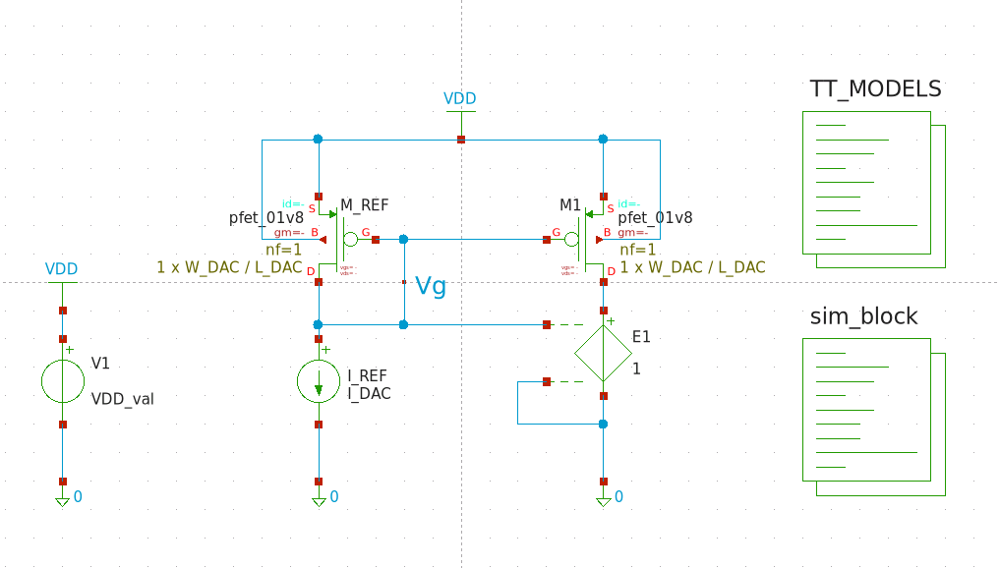
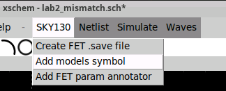

# **PPAU VLSI - Labolatorium 2**

Podczas tych zajęć poddane będą analizie rozrzuty technologiczne, jakie występują w zintegrowanych układach elektronicznych. W pierwszych krokach będą analizowane rozrzuty prądu klasycznego źródła prądowego i parametry od jakich one zależą, a następnie zbudowany będzie 5-cio bitowy przetwornik cyfrowo-analogowy DAC z ważonymi prądami.  
Wykorzystywane środowisko to IIC-OSIC-TOOLS ([github](https://github.com/iic-jku/iic-osic-tools)), a używany PDK to sky130A od SkyWater Foundries ([pdk-documentation](https://skywater-pdk.readthedocs.io/en/main/index.html))

## **1. Rozrzuty w zintegrowanych układach logicznych**
---

1.1. Przygotuj schemat układu źródła prądowego z Rys. 1. Jako tranzystorów użyj **pfet_01v8.sym** z biblioteki **sky130_fd_pr** (fd - The SkyWater Foundry, pr - Primitive Cells; więcej o nazewnictwie w sky130 PDK można znaleźć [tutaj](https://skywater-pdk.readthedocs.io/en/main/contents/libraries.html#library-naming)), a dla całego schematu użyj parametrów:  
   * szerokość i długość kanału mosfetów -> odpowiednio **W_DAC** i **L_DAC**  
   * Źródłu prądowemu -> parametr **I_DAC**  
   * Źródłu napięcia -> parametr **VDD_val**  

Aby w realizowanych analizach wyeliminować błąd systematyczny związany z różnymi napięciami Vds tranzystorów, użyj źródła napięciowego **vcvs.sym** z domyślnie dostępnej biblioteki **devices** z ustawionym wzmocnieniem 1. Elementy widoczne na schemacie takie jak źródła prądowe, napięciowe, symbole zasilania, uziemienia czy bloki kodu także można znaleźć w tej bibliotece. Napięcie zasilania VDD powinno być równe 1.8V.  
Wykorzystany blok kodu o nazwie TT_MODELS to gotowy blok, który jest łatwo i szybko dostępny wybierając na pasku menu `SKY130 -> Add model symbol` (Rys 2.) i dla parametrów typowych nie musi być edytowany.

<figure style="text-align: center; page-break-inside: avoid; break-inside: avoid;">
  
  <figcaption>Rys 1. Schemat źródła prądowego.</figcaption>
</figure>

<figure style="text-align: center; page-break-inside: avoid; break-inside: avoid;">
  
  <figcaption>Rys 2. Dodanie bloku kodu zawierającego bibliotekę.</figcaption>
</figure>

1.2. Dla trzech różnych wymiarów tranzystorów tj. W / L odpowiednio:  
* 0.24 / 0.18 [μm]  
* 5  / 2 [μm]  
* 2 / 5 [μm]  
oraz dwóch różnych prądów I_DAC:
* 100 [nA]  
* 10 [μA]  
> Wyznacz napięcia **Vgs** i **Vth** tranzystora M1. Uzyskane wyniki zanotuj w sprawozdaniu.

1.3. Aby przeprowadzić analizy Monte Carlo musisz wskazać środowisku symulacyjnemu modele elementów technologicznych, w których będą występowały parametry związane z rozrzutami technologicznymi. Modele te są identyczne jak te stosowane do tej pory, a różnią się jedynie dodatkowymi zmiennymi odpowiedzialnymi za rozrzuty.  
W tym celu wystarczy zmienić parametr, z którym wywoływana jest biblioteka w bloku TT_MODELS. W lini, w której załączana jest biblioteka (.lib $::SKYWATER_MODELS/sky130.lib.spice tt) zamień `tt` na wybrany corner. Na razie zastąp to przez `tt_mm`. Warto też zobaczyć co dokładnie znajduje się w załączanym pliku. 
``` bash 
cd /foss/pdks/sky130A/libs.tech/ngspice
view sky130.lib.spice
```
 
1.4. W środku pliku `sky130.lib.spice` można zauważyć dużo zdefiniowanych cornerów wraz z informacją, które biblioteki z tego folderu są dołączane. Dla każdego corneru ustawiane są dwa parametry - przejrzyj cornery i zastanów się do czego są te parametry i co oznaczają.  

---

1.5. W dalszym kroku skonfiguruj symulację Monte Carlo. W tym celu, w rozwijanym menu w górnej części okna ADE Assembler wybierz opcję Monte Carlo Sampling (Rys. 1.5). Kliknij ikonę znajdującą się na prawo od tego rozwijanego menu i ustaw parametry tak jak na Rys. 1.5. Dzięki temu przeprowadzisz 10 analiz MC, w których będziesz uwzględniać rozrzuty technologiczne bez wpływu procesu (zaznaczona opcja Variation = Mismatch) i będziesz archiwizować wyniki tych symulacji (zaznaczona opcja Save Waveforms (Simulation Data), Save Statistical Parameter Data). Kliknij OK. Zanim uruchomisz próbną symulację, zdefiniuj w zakładce Output Setup prąd płynący przez źródło napięcia E0 (podpowiedź: IDC ("/EO/PLUS")). Uruchom symulację przyciskiem Run i sprawdź jak bardzo rozrzuca się prąd wyjściowy źródła prądowego. Zastanów się nad znaczeniem kolumn Min, Max, Mean, StdDev. Sprawdź również, jak w Cadence możesz wyświetlić wyniki w innej formie: plotowania wyników lub histogramu (rys. 1.6).  

Konfiguracja między Variation = Mismatch / Process / Mismatch & Process będzie u nas załatwiana poprzez parametry mc_mm_switch, mc_pr_switch oraz dołączanie odpowiednich bibliotek.  

1.6. W środowisku Cadence istnieje możliwość wskazania, które elementy mają być brane/nie brane pod uwagę podczas analiz MC. Jest to bardzo pomocne w sytuacji, gdy chcemy dowiedzieć się, od jakiego elementu pochodzi dominująca kontrybucja rozrzutów. By zastosować tę opcję, naciśnij przycisk Specify Instances/Devices (Rys. 1.5). Pojawi się okno jak na Rys. 1.7.  

CZY DA SIĘ WYBRAĆ KTÓRY ELEMENT MA ULEGAĆ ROZRZUTOM W XSCHEM???? xx

1.7. W naszych następnych symulacjach chcemy analizować rozrzuty pochodzące jedynie od tranzystora M1. Dlatego wybierz opcje Variation = Mismatch i Selected = No Variation, następnie Subcircuit (p_18_mm) i dodaj tranzystor M_REF do listy. Po zakończeniu tych operacji Twoje okno powinno wyglądać jak na Rys. 1.8.  

1.8. Przeprowadź analizy Monte Carlo (100 prób dla każdego z przypadków) dla wariantów prądów oraz wymiarów tranzystorów M_REF i M1 podanych uprzednio. Uzyskane wyniki σ/AVG (sigma/wartość średnia) zanotuj w sprawozdaniu. Uzupełnij wszystkie brakujące pola w tabeli.  


1.9. Odpowiedz na poniższe pytania:  
> a) dlaczego dla tych samych wymiarów tranzystorów a różnych prądów znacząco różnią się wartości σ/AVG?  
> b) dlaczego dla tych samych zarówno powierzchni tranzystorów jak i ich prądów wartości σ/AVG różnią się pomiędzy sobą?  
> c) wskaż dwa z analizowanych przypadków, które dowodzą różnych kontrybutorów rozrzutów (kontrybucja od napięcia progowego, kontrybucja od współczynnika prądowego).  

**!!! TBEDITED !!!**  
1.10. Sprawdź stopień kontrybucji rozrzutów prądu wyjściowego (σ/AVG) dla trzech przypadków (rozważ tylko przypadek 2 / 5 [μm] oraz I_DAC = 10 μA):  
> a) Variation = Mismatch, Selected = Mismatch, Unselected = No Variation, uwzględniamy tylko tranzystor MO,  
> b) Variation = Mismatch, Selected = Mismatch, Unselected = No Variation, uwzględniamy tylko tranzystor M_REF,  
> c) Variation Mismatch, uwzględniamy rozrzuty obu tranzystorów (czyli nie wybieramy żadnych instancji w oknie Specify Instances for Monte Carlo).  

Wyniki zapisz w sprawozdaniu. Czy są one zgodne z Twoimi przypuszczeniami? Dlaczego?  

1.11. Powtórz symulacje z poprzedniego punktu uwzględniając rozrzuty Process i Mismatch (Variation All, Selected = Mismatch and process, Unselected = Process). Wyjaśnij występujące różnice.  

--- 

## **2. Schemat 5-bitowego DAC-a**
---

TBD

## **3. Layout 5-bitowego DAC-a**

TBD

## POSSIBLE SIMULATION ERRORS
---