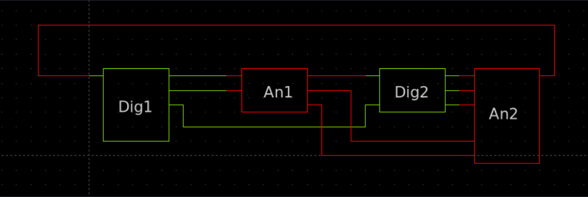
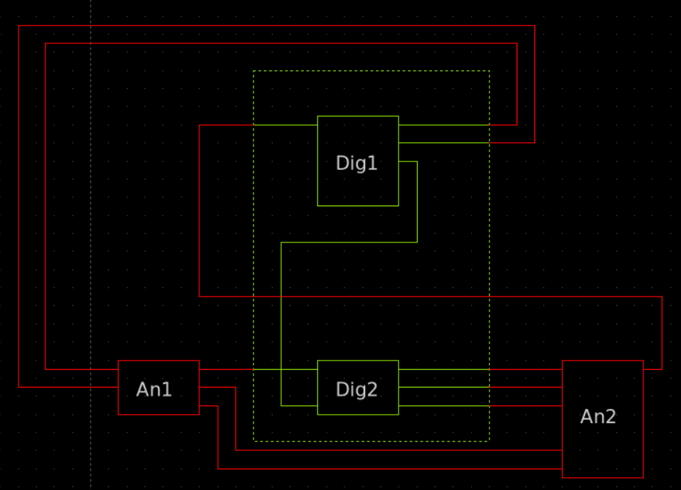

# Labolatorium 2 - Uwagi, problemy, todo list
## Napotkane (niektóre/wybrane) problemy

---

**Problem**: Przy włączaniu schematica *DAC_CORE_5bit_test.sch* schemat potrafi się zablokować i nie dać możliwości do edycji pliku. Dzieje się tak zazwyczaj gdy użytkownik chce edytować parametry i zamknie okno dialogowe edytowania parametrów. Na początku nie było tego problemu - musiał wystąpić po którymś z `sudo apt update && sudo apt ugrade -y` i restartach pc.  
Błąd w konsoli:  

```
xschem [/foss/designs/lab2/xschem] tcleval(): evaluation of script: edit_prop {Input property:} failed
        : window ".dialog" was deleted before its visibility changed
```

**Rozwiązanie**: Zauważyłem, że dzieje się tak gdy użytkownik przed edycją nie stworzy netlisty schematu przed edycją - czyli po włączeniu schematu należy zbudować netlistę. Nie znalazłem jeszcze konkretnego powodu dlaczego to ma wpływ, więc jest to chwilowe rozwiązanie.  
* Da się to rozwiązać przez ustawienie `set xschem_execute_scripts "yes"` w pliku xschemrc, który może być stworzony w lokalnym folderze, w którym przechowujemy schematy, testy, itd dla xschema. Xschem szuka tego pliku w ścieżce wywoływania więc jeśli zrobimy `xschem /designs/xschem/files/` będąc w /designs, a xschemrc w files/ to nie zostanie wzięty pod uwagę. Dochodzą również problemy z symulacjami, które miałem, więc ostatecznie porzuciłem to rozwiązanie - bez resetu dockera miałoby to rozwiązanie o wiele więcej sensu.  
* Również odnosi się to pośrednio to kolejnego na liście problemu - to co Defaultowo jest przez `SKY130->Add models symbol` może być zmienione poprzez modyfikację /foss/pdks/sky130A/libs.tech/xschem/xschemrc, ale to nie będzie pernamentna zmiana, a wyłącznie na obecną sesję dockera, do stałej zmiany można dodać plik /foss/designs/xschemrc POD WARUNKIEM że będziemy startować każdy schematic z folderu /foss/designs co przy dużej ilości podfolderów i plików, czy kilkuosobowej pracy nad jednym projektem, może być niewygodne (trzeba być zapoznanym z drzewem folderów).  

---

**Problem**: trzeba znaleźć sposób na uwzględnienie rozrzutów tylko pojedynczego tranzystora i uzupełnić punkty 1.5 - 1.7  
**Rozwiązanie**: znalazłem sposób - stworzenie idealnego modelu tranzystora, który lokalnie ma wyłączone parametry `mc_mm_switch` oraz `mc_pr_switch`. W sky130 jest to łatwe do wykorzystania - wystarczy zmienić parametr `model` tranzystora z `pfet_01v8` na `pfet_ideal`.  
Zastosowany model:  

``` spice
* disable pfet_ideal from mismatch/process
.subckt sky130_fd_pr__pfet_ideal D G S B W=0.42 L=0.15
+ nf=1 ad='int((1 + 1)/2) * {W} / 1 * 0.29' as='int((1 + 2)/2) * {W} / 1 * 0.29'
+ pd='2*int((1 + 1)/2) * ({W} / 1 + 0.29)' ps='2*int((1 + 2)/2) * ({W} / 1 + 0.29)' 
+ nrd='0.29 / {W}' nrs='0.29 / {W}' sa=0 sb=0 sd=0 mult=1
.param mc_mm_switch=0
.param mc_pr_switch=0
XIDEAL D G S B sky130_fd_pr__pfet_01v8 W={W} L={L}
+ nf={nf} ad={ad} as={as} pd={pd} ps={ps} 
+ nrd={nrd} nrs={nrs} sa={sa} sb={sb} sd={sd} mult={mult}
.ends
```

* *dla bardzo małych prądów, mogą powstawać niedokładności między dużą ilością powtórzeń. Czemu? Może to przez niedokładności w modelowaniu? to raczej nie jest problem tylko z .subckt - dla pfetów prosto z sky130 też tak to wygląda - sprawdzić jeszcze trzeba i sie zastanowić*  

---

**Problem**: Dla źródeł prądowych VTH jest na poziomie 1V dla W/L= 2/5 przez co nie jesteśmy w stanie uzyskać prądu bliskiego 10uA, dla W/L= 2/5 vgs ~= 1.9V dla zasilania 1.8V X_X  
**Rozwiązanie**: nie bawić się w lvt-pfets, można na spokojnie modyfikować wymiarowanie - modyfikacja W/L, **obecnie 3.5/5**, bez problemu można by było zostać przy W = 2 i zmniejszać L do momentu uzyskania odpowiedniego prądu, efekty krótkiego kanału są tu znikome/pomijalne dla L >> 2*L_minimum  

---

**Problem**: Zastanów się jak zrobić symulacje cornerowe dla każdego przypadku - chodzi o każdy corner w jednej symulacji, czy jest to wogóle możliwe, jesli nie - po prostu zmieniaj corner co symulacje  
**Rozwiązanie**: Zostałem przy drugiej opcji, pierwsza ma problem z załączaniem różnych bibliotek modeli i nie znalazłem na to obejścia.  

---

**Problem**: Trzeba znaleźć sposób na ekstrakcje RC parasitics  
**Rozwiązanie**: Są do tego narzędzia: Klayout-pex lub Magic, przykładowe rozwiązania:  
  * klayout-pex tool:
  ```
  kpex --gds DAC_CORE_5bit.gds \
   --cell DAC_CORE_5bit \
   --pdk sky130A \
   --magic \
   --magic_mode RC \
   --schematic /foss/designs/lab2/xschem/DAC_CORE_5bit.spice \
   --out_spice DAC_CORE_5bit_pex.spice
  ```
  lub
  ```
  kpex --gds DAC_CORE_5bit.gds \
   --cell DAC_CORE_5bit \
   --pdk sky130A \
   --2.5D \
   --mode RC \
   --schematic /foss/designs/lab2/xschem/DAC_CORE_5bit.spice \
   --out_spice DAC_CORE_5bit_pex2.spice
  ```
  * magic extract:
  ```
  magic -dnull -nocmd
  gds read DAC_CORE_5bit.gds
  load DAC_CORE_5bit
  extract all
  ext2sim labels on
  ext2sim
  extresist tolerance 10
  extresist
  ext2spice lvs
  ext2spice ground VDD
  ext2spice defaultsub VDD
  ext2spice cthresh 0.1
  ext2spice extresist on
  ext2spice -o DAC_CORE_5bit_mpex.spice
  exit
  ```
  * **!!! WAŻNE: SPRAWDŹ CZY ZGADZA SIĘ KOLEJNOŚĆ PINÓW MIĘDZY SYMBOLEM ZE SCHEMATU A .SUBCKT W PLIKU _PEX PRZED ROZPOCZĘCIEM SYMULACJI !!!** 

---

**Problem**: kosymulacja wprowadza opóźnienie **1ns** względem układów analogowych, co dla sygnału który początkowo przyjąłem 10ns (100MHz) czyli zmiany co 5ns - opóźnienie było bardzo widoczne.  
**Rozwiązanie**: długo mi to zajęło ale rozwiązanie jest proste jak sie już wie ocb - dla opisywanego modelu d_cosim należy ustawić parametr `delay` na **1p**. Nie da się ustawić mniej niż 1ps więc w praktyce dlatego delay jest widoczny w przypadku zestawienia układów *analog vs digital* w połączeniu równoległym.  
**Wniosek**: AI potrafiło znaleźć 13 różnych problemów i solucji, z których żadna nie działała, a wystarczyło kilka sekund, ctrl+F i spojrzeć do napisanego przez twórców 800 stron manuala (chapter 8.4.25). S. Schippers zrobił dobry przykład ale nie wyjaśniał wszystkiego więc samemu się trzeba domyślać co i dlaczego jest tak, a nie inaczej zrobione - dopiero pod koniec pracy uświadomiłem sobie, że korzysta on z dostępnych w xschem/ngspice modeli, które zostały specjalnie dodane dla symulacji mieszanych (m.in. d_cosim, adc/dac_brigde)  

---

**Problem**: **NIE MOŻNA** mieć dwóch instancji **d_cosim** jednocześnie na jednym schemacie - chciałem zawrzeć w jednym pliku inv_test.sch porównanie między inverterami równoległymi (cmos równolegle do sv, widać wtedy, że sv zawsze ma delay względem analogowego układu w symulacji) i szeregowymi (cmos->sv->cmos; te które miałem rzeczywiście przetestować czy działa)  
**Rozwiązanie**: Musiałem stworzyć dwa osobne schematy testowe - **NIE DA SIĘ** zrobić tego w jednym pliku, tak aby na schemacie jasno było widoczne, że są to dwie różne instancje invertera. *Da się* zrobić, taką symulację, ale wymaga to podłączenia tych dwóch modułów w jednym module TOP - co sprowadzałoby się do stworzenia nowego symbolu, który będzie miał 2 osobne wejścia/wyjścia lub BUS wyjść/wejść.  
Bardzo dobrze opisuje to S. Schippers cytując manual ngspice'a w [TYM POŚCIE](https://github.com/StefanSchippers/xschem/discussions/417#discussioncomment-14468540), w skrócie - nie jest możliwe rozwiązanie tego problemu bez przemyślenia konstrukcji i układu połączeń tak jak na poniższych zdjęciach

<figure style="margin: 12px 0;">
  <table style="width: 100%; border-collapse: collapse;">
    <tr>
      <td style="width: 50%; text-align: center; vertical-align: bottom; padding: 0 5px;">
        
        <div>a)</div>
      </td>
      <td style="width: 50%; text-align: center; vertical-align: bottom; padding: 0 5px;">
        
        <div>b)</div>
      </td>
    </tr>
  </table>
  <figcaption style="text-align: center;">Przykład z dyskusji na githubie: a) tak połączonych układów nie da się zasymulować, b) zamknięcie dwóch modułów w jeden większy pozwala na przeprowadzenie symulacji mieszanej (moduł TOP).</figcaption>
</figure>

---

## Uwagi do programów i wykonywanych instrukcji

* Co do samej instrukcji - dodać więcej zdjęć (łatwiej się pracuje z referencyjnymi zdjęciami) lub wstawiać pomocnicze fragmenty kodu (większość ustawiania to po prostu ngspice code)  

* Klayout jest dość intuicyjny, ale importowanie z netlisty wymaga aktualizacji "Packages", co trzeba robić za każdym odpaleniem dockera - nie znalazłem jeszcze jednoznacznego rozwiązania, dzięki któremu mógłbym mieć najnowsze makra dla każdej instancji dockera (.designinit w folderze design - do testu; widzę że na gitcie iic osic tools jest nadal rozwijane, w zeszłym tygodniu był commit o updatecie niektórych narzędzi na branch next_release); 
  * tworzenie własnych makr (wymaga wiedzy o samym klayout i pdk'ach; kodowanie w pythonie) i dostęp do utworzonych przez użytkowników na plus - obecnie nie jest ich wiele ale, niektóre są przydatne, pomagają w nauce oprogramowania (przykłady: import from netlist, graphical layout keybindings);  
  * najlepiej od razu odpalać klayout w trybie do edycji `klayout -e`, podobny problem jak z makrami da się zmienić żeby default launch był w trybie edycji, ale jak zrobić żeby zmiana została zapisana (znowu .designinit, modyfikacja samego iic tools albo skryptu starnowego?, )  

* W punkcie 3.10. była uwaga - "zwróć uwagę na etykiety pomiędzy kluczami a źródłami prądowymi. Bez tych etykiet możesz mieć problem z analizą LVS." - nie zauważyłem żeby to było problemem dla sky130 LVS: 
  * jeżeli schemat będzie miał podpisy `M*_C`, a na layoutcie nie podpiszemy / nie użyjemy warstwy label dla podpisania tych netów to na podstawie instancji LVS automatycznie je wykryje i przypisze (Rys 3.xx.).  
  * Jeżeli nie podpiszemy netów w schemacie to spice i tak musi mieć nazwy na nety i zostanie po prostu `net*` co znowu - zostanie automatycznie wykryte przez LVS.  

* Żeby podłączyć B do VDD należy rozlać *Nwell* pod całą matrycą ORAZ guard ringiem (tak, żeby położony *Nwell* pokrywał również *nsdm* z generowanego guard ringa)  

## TODO LIST
1. Znaleźć sposób na uwzględnienie rozrzutów tylko pojedynczego tranzystora i uzupełnić punkty 1.5 - 1.7 (znalazłem sposób - trzeba uzupełnić insturkcję) - **zrobione**  
2. Przeprowadź analizę MC z punktu 1.8 i zapisz wyniki (kod do symulacji gotowy - ustawić M_REF jako mosfet idealny) - **zrobione**  
3. Zaktualizuj polecenie 1.10 uwzględniając odpowiednie parametry i sposoby na rozrzucanie pojedynczego tranzystora - **zrobione**  
4. Wykonaj symulacje zgodnie z punktem 1.11 - **zrobione**  
5. **5BIT DAC SCHEMATIC** - **zrobione**  
6. Stwórz symbol dla 5bit dac - **zrobione**  
7. Stwórz schemat symulacyjny - **zrobione**  
8. Przeprowadź symulacje działania układu - **zrobione**  
9. Zastanów się jak zrobić symulacje cornerowe dla każdego przypadku - **zrobione**  
10. Layout DAC-a - **zrobione**  
11. Ekstrakcja parasitic - **zrobione**  
12. Uzupełnić lab2_wyniki -> tabelki, zdjęcia, odpowiedzi na pytania - **TBD - UZUPEŁNIĆ 3.14**  
13. jeśli skończę instrukcję -> przetestować jak zrobić symulację mieszaną: inwerter kontrolowany cyfrowo() i analogowo; przykładowo 3 inwertery - 1szy opisany kodem verilog, drugi analogowo na tranzystorach, trzeci w kodzie verilog znowu; - **zrobione**  
14. zrobić instrukcje/podsumowanie dla symulacji mieszanych - **zrobione, jeszcze można dla Verilatora zrobić**
15. może test spectre do xschema??  

