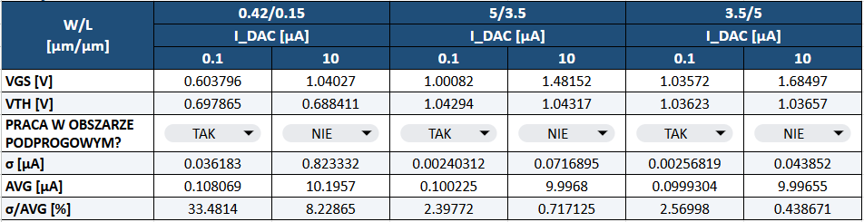
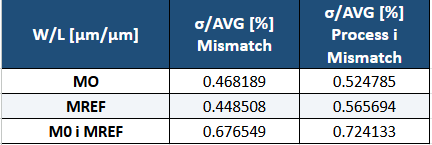
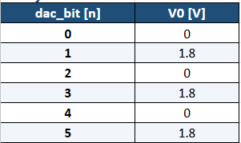
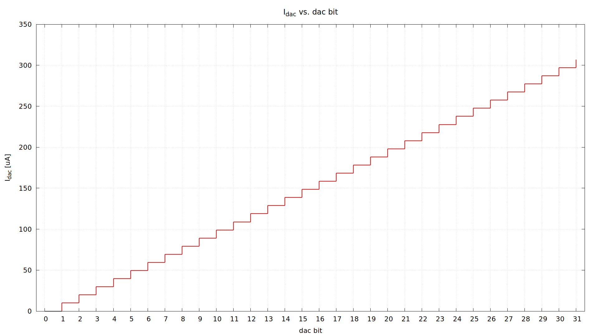
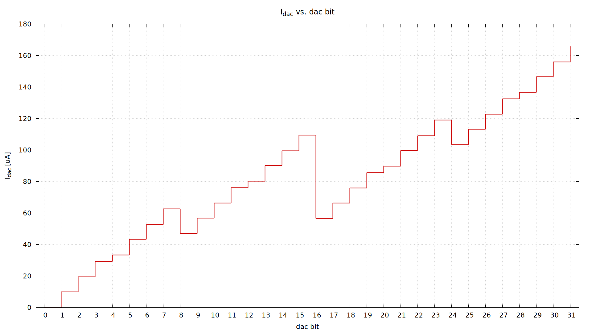
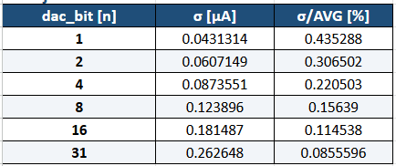
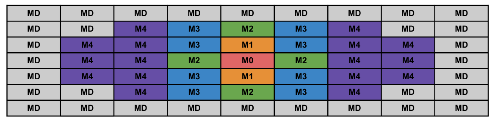
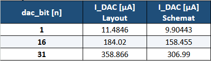
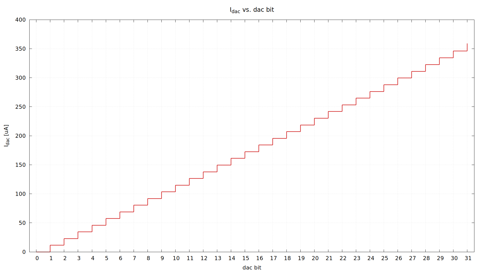

# **PPAU VLSI - Labolatorium 2 - Wyniki i odpowiedzi**

## **1. Rozrzuty w zintegrowanych układach logicznych**
---

### **1.2/1.8**  
<figure style="text-align: center; page-break-inside: avoid; break-inside: avoid;">
  
  <figcaption>Tabela 1.2/1.8</figcaption>
</figure>  

### **1.9**  
**Odpowiedź**:  
a) Dla tych samych wymiarów, ale różnych prądów, zmienia się punkt pracy tranzystora - dla napięcia blisko pod progiem nawet małe zmiany w Vth powodują duże rozrzuty prądu, przez co sigma/Id jest zdecydowanie większa od tej w gdy PMOS jest w saturacji.  
b) Dla takiego samego obszaru lepiej, aby tranzystor był dłuższy, niż szerszy, ponieważ zmniejszamy wpływ krótkiego kanału, zwiększamy r_o, zmniejszamy wpływy efektów brzegowych, zmniejszamy Betę ( = uCox(W/L) ).  
c) PMOS o minimalnych wymiarach - pokazuje wpływ rozrzutu Vth na rozrzuty prądu Id.  
Dwa PMOSy o wymiarach 3.5/5 i 5/3.5 (taki sam obszar W*L) - dla PMOSa 2/5 mamy rozrzuty mniejsze niż dla 5/3.5, widoczny tu jest wpływ Bety na rozrzuty Id.  

### **1.10/1.11**  
<figure style="text-align: center; page-break-inside: avoid; break-inside: avoid;">
  
  <figcaption>Tabela 1.10/1.11</figcaption>
</figure>  

**Odpowiedź 1.10**:  
Ze względu na schemat układu spodziewamy się podobnego wpływu mismatchu na prąd dla pojedyńczych tranzystorów (Przypadek M0 lub M_REF) co potwierdzają wyniki. Przy wpływie mismatchu obu tranzystorów jednocześnie spodziewamy się większego rozrzutu prądu, który rośnie z pierwiastkiem źródeł rozrzutów (tutaj: sqrt(2), do rozrzutu przyczynia się M0 i M_REF).  
**Odpowiedź 1.11**:  
Możemy zauwazyć że różnice między mismatch + process, a samym mismatchem są niewielkie, dają praktycznie te same rezultaty. Wynika to z tego jak wprowadzane są te zmiany - mismatch wpływa na każdy tranzystor osobno, a process powoduje, że jeden z parametrów jest modyfikowany na podstawie procesu technologicznego i wpływa od jednakowo na każdy z tranzystorów. Przez to głównymi zauważalnymi rozrzutami są te wynikające z mismatchu.

## **2. Schemat 5-bitowego DAC-a**
---

### **2.2**  
**Odpowiedź**:  
Tak jest istotne - to czy mamy więcej czy mniej kluczy wpływa na rezystancję kluczy i napięcie na drenach PMOSów działających jako źródła prądowe, przez co prąd jest zależny od ilości kluczy (zmiany Vds dla źródeł prądowych).  

### **2.3**  
<figure style="text-align: center; page-break-inside: avoid; break-inside: avoid;">
  
  <figcaption>Tabela 2.3</figcaption>
</figure>  

### **2.4**  
RES_DAC[kOhm] = 11.37  
I_DAC[uA] = 306.99  

<figure style="text-align: center; page-break-inside: avoid; break-inside: avoid;">
  
  <figcaption>Wykres I_DAC vs dac_bit przed zmianami.</figcaption>
</figure>  

<figure style="text-align: center; page-break-inside: avoid; break-inside: avoid;">
  
  <figcaption>Wykres I_DAC vs dac_bit po zmianach.</figcaption>
</figure>  

### **2.5**  
<figure style="text-align: center; page-break-inside: avoid; break-inside: avoid;">
  
  <figcaption>Tabela 2.5</figcaption>
</figure>  

**Odpowiedź**:  
Sigma_Id rośnie z liczbą załączonych tranzystorów, a sigma_Id/Id_AVG maleje, czyli rozrzut prądu rośnie, ale względny rozrzut maleje - jest to zależność: sigma_Id/sqrt(N), gdzie N to liczba załączonych tranzystorów. Jest to zalezność wynikająca z sumy źródeł mismatchu ( Id_AVG rośnie jednostkowo N krotnie (Id dla dac_bit =1 jest mnożone o N, czyli efektywnie o dac_bit), a suma rozrzutów jest liczona w kwadracie)  

### **2.6**  
I_DAC(dac_bit=31):  
MIN[uA] = 306.179 MAX[uA] = 307.734 AVG[uA] = 306.972  

### **2.10**  
I_DAC(dac_bit=31):  
MIN[uA] = 276.24(sf) MAX[uA] = 336.884(fs) AVG[uA] = 306,631  
**Odpowiedź**:  
Wyniki analizy cornerowej są zdecydowanie mniej korzystne - pokazują większy rozrzut prądu i bardziej ekstremalne przypadki, które mogą prowadzić do przekroczenia dopuszczalnych błędów DAC-a, ale te uzyskane z analizy Monte Carlo są bardziej prawdopodobne i przewidywane. Analiza cornerowa pozwala nam zobaczyć najgorsze przypadki, które jednak i tak mogą się zdarzyć i należy brać je pod uwagę przy analizie pracy układu.

## **3. Layout 5-bitowego DAC-a**
---

### **3.7**  
**Odpowiedź**:  
Matrycę kluczy elektronicznych można stworzyć podobnie tworząc komórkę podstawową - wspólnym połączeniem dla tej matrycy będzie połączenie **drenów** (wyjście I_DAC).  

### **3.12**  
<figure style="text-align: center; page-break-inside: avoid; break-inside: avoid;">
  
  <figcaption>Geometria tranzystorów w matrycy (Common Centroid).</figcaption>
</figure>  

### **3.14**  
<figure style="text-align: center; page-break-inside: avoid; break-inside: avoid;">
  
  <figcaption>Tabela 3.14</figcaption>
</figure>  

<figure style="text-align: center; page-break-inside: avoid; break-inside: avoid;">
  
  <figcaption>Wykres I_DAC vs dac_bit po ekstrakcji.</figcaption>
</figure>  

**Odpowiedź**:  
Z otrzymanych wartości prądu (dla całego zakresu dac_bit 0 - 31) można zobaczyć, że prąd dla kroku bitowego wzrósł o ok 1.5uA, a przy większej ilości bitów jest nawet większy. To oznacza że pojemności i rezystancje pasożytnicze modyfikują punkt pracy źródeł prądowych - zwiększając Vgs lub Vds tych źródeł w matrycy prądowej.  

### **3.15**  
**Odpowiedź**: - 

